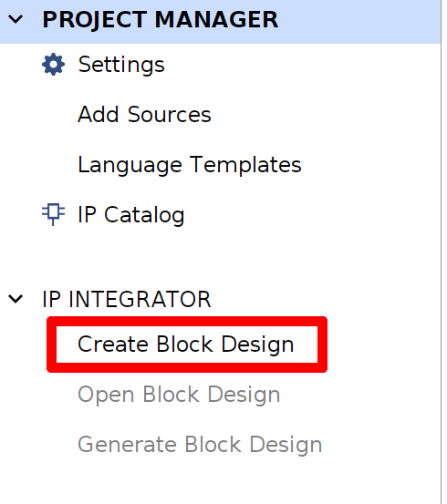
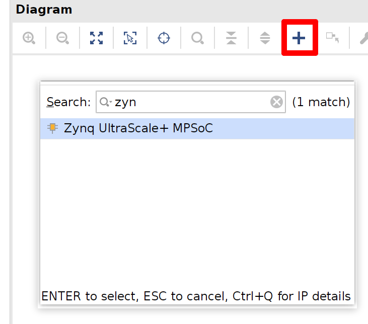
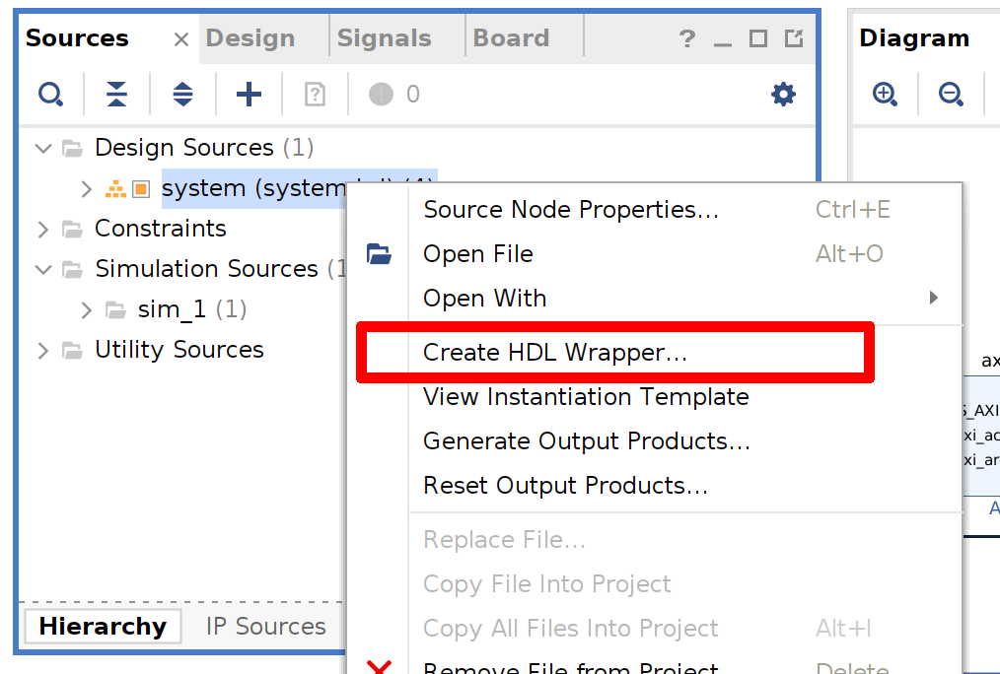

# BasicPetaLinux

Minimum petalinux example with GPIO LED only.

## Target
### Software

* Xilinx Vivado 2023.2
* PetaLinux 2023.2

### Hardware

* Genesys ZU 3EG Board : Zynq MPSoC

## Create Vivado Project and Build

You can find prebuilt project in `hw` directory.

1. Create new RTL project in Vivado

You need to select board `Genesys ZU 3EG`. If you cannot find board, refresh list first.


2. Create new block design




3. Add Zynq MPSoC IP

Add Zynq MPSoC IP and run block automation and apply board preset. Then double click block and add 1 bit GPIO EMIO. This will be I2C mux reset pin.




3. Add AXI GPIO IP

Add AXI GPIO IP and run block automation with GPIO (led 4bits), S_AXI (auto).


4. Connect remains

Connect `saxihpc0_fpd_aclk` to `pl_clk0`. Make external to GPIO_0 of Zynq block.


5. Validate block design

6. Create HDL Wrapper



7. Add constraints

Add constraints using `constraints/Genesys-ZU-3EG-D-Master.xdc`. Make sure I2C mux pin match to name in external pin. In this case, it will be `GPIO_0_0_tri`. The GPIO LED pins can be skipped since they are handled internally.

7. Generate bitstream

8. Export hardware

Run `File/Export/Export Hardware` with `Include bitstream`.

## Create PetaLinux Project and Build

You can find prebuilt project in `os` directory.

1. Create new PetaLinux project

```
petalinux-create --type project --template zynqMP --name test_min
```

2. Configure project with exported hardware

Specifies the exported xsa directory.

```
petalinux-config --get-hw-description ../hw
```

Enable `Auto Config Settings/Specify a manual device tree include directory` and set to default value, `${STAGING_KERNEL_DIR}/include`.

To boot with tftp, change tftp directory in `Image Packaging Configuration/tftpboot directory` to `/srv/tftp`.

To boot with writable rootfs, change the root file system type in `Image Packaging Configuration/Root filesystem type` to `ext4`. The default is `initrd` and changes will not be saved. Leave it as `initrd` if you don't care.

3. Edit user device tree file

Edit `project-spec/meta-user/meta-xilinx-tools/recipes-bsp/uboot-device-tree/files/system-user.dtsi` before building. The file below was taken from https://github.com/Digilent/Genesys-ZU and edited for 2023.2.

```
/include/ "system-conf.dtsi"
#include <dt-bindings/interrupt-controller/irq.h>
#include <dt-bindings/gpio/gpio.h>
#include <dt-bindings/media/xilinx-vip.h>
#include <dt-bindings/net/ti-dp83867.h>
#include <dt-bindings/phy/phy.h>
#include <dt-bindings/mux/mux.h>

/ {
};

&pinctrl0 {
	status = "okay";

	pinctrl_i2c0_default: i2c0-default {
		mux {
			groups = "i2c0_5_grp"; /* MIO22, MIO23 */
			function = "i2c0";
		};

		conf {
			groups = "i2c0_5_grp";
			bias-pull-up;
			slew-rate = <0>;
			io-standard = <1>;
		};
	};

	pinctrl_i2c1_default: i2c1-default {
		mux {
			groups = "i2c1_2_grp"; /* MIO8, MIO 9 */
			function = "i2c1";
		};

		conf {
			groups = "i2c1_2_grp";
			bias-pull-up;
			slew-rate = <0>;
			io-standard = <1>;
		};
	};
};

&sdhci1 {
	disable-wp;
	xlnx,itap-delay-sd-hsd = <0x29>;
	xlnx,itap-delay-sd-ddr50 = <0x32>;
	xlnx,itap-delay-sdr25 = <0x2A>;
	xlnx,itap-delay-sdr50 = <0x1E>;
	xlnx,itap-delay-sdr104 = <0x0B>; //although auto-tuned, tuning fails on some cards if not set
};

/*
devicetree/bindings/net/macb.txt
devicetree/bindings/net/ti,dp83867.txt
devicetree/bindings/net/phy.txt
*/
&gem0 {
	phy-handle = <&phy0>;
	phy-mode = "rgmii-id";
	phy0: phy@15 {
		reg = <0x0F>;
		reset-gpios = <&gpio 44 GPIO_ACTIVE_LOW>;
		reset-assert-us = <1>;
		reset_deassert-us = <200>;
		interrupt-parent = <&gpio>;
		interrupts = <38 IRQ_TYPE_LEVEL_LOW>;
		ti,rx-internal-delay = <DP83867_RGMIIDCTL_2_00_NS>; //overwrites strap config
		ti,tx-internal-delay = <DP83867_RGMIIDCTL_1_50_NS>; //overwrites strap config
		ti,fifo-depth = <DP83867_PHYCR_FIFO_DEPTH_4_B_NIB>;
		ti,clk-output-sel = <DP83867_CLK_O_SEL_REF_CLK>;
	};
};

/*
Adding support for the mux and expose all 8 segments.
RESET# pin of TCA9548 is inverted on-board. Mapped to
EMIO[0] which is line 78.
devicetree/bindings/i2c/i2c-mux-pca954x.txt
devicetree/bindings/mux/mux-controller.txt
*/
&i2c0 {
	pinctrl-names = "default";
	pinctrl-0 = <&pinctrl_i2c0_default>;

	i2c-mux@70 {
		compatible = "nxp,pca9548";
		#address-cells = <1>;
		#size-cells = <0>;
		reg = <0x70>;
		reset-gpios = <&gpio 78 GPIO_ACTIVE_HIGH>;
		i2c-mux-idle-disconnect;
		idle-state = <MUX_IDLE_DISCONNECT>;
		i2c@0 {
			#address-cells = <1>;
			#size-cells = <0>;
			reg = <0>;
		};
		i2c@1 {
			#address-cells = <1>;
			#size-cells = <0>;
			reg = <1>;
		};
		i2c@2 {
			#address-cells = <1>;
			#size-cells = <0>;
			reg = <2>;
		};
		i2c@3 {
			#address-cells = <1>;
			#size-cells = <0>;
			reg = <3>;
			/* skip PMBUS */
		};
		i2c@4 {
			#address-cells = <1>;
			#size-cells = <0>;
			reg = <4>;
			eeprom@51 { /*FMC VITA 57.1 FRU*/
				compatible = "atmel,24c02";
				reg = <0x51>;
				pagesize = <1>; /* varies between models, so use a safe value */
			};
		};
		i2c@5 {
			#address-cells = <1>;
			#size-cells = <0>;
			reg = <5>;
			/* not sure if we should bind the eeprom driver to the SYZYGY DNA */
			eeprom@30 { /* SYZYGY DNA */
				compatible = "atmel,24c02";
				reg = <0x30>;
				read-only;
				address-width = <16>;
				size = <65536>; /*the whole 16-bit address range*/
			};
		};
		i2c@6 {
			#address-cells = <1>;
			#size-cells = <0>;
			reg = <6>;
		};
		i2c@7 {
			#address-cells = <1>;
			#size-cells = <0>;
			reg = <7>;
		};
	};
};

&i2c1 {
	pinctrl-names = "default";
	pinctrl-0 = <&pinctrl_i2c1_default>;
};

&spi0 {
	gpioexp: gpio@1 {
		compatible = "microchip,mcp23s08";
		gpio-controller;
		#reset-cells = <1>;
		#gpio-cells = <2>;
		interrupt-parent = <&gpio>;
		interrupts = <25 IRQ_TYPE_LEVEL_LOW>;
		microchip,spi-present-mask = <0x01>;
		interrupt-controller;
		#interrupt-cells = <0x2>;
		reg = <1>; /*SS[1]*/
		spi-max-frequency = <10000000>;
	};
};

&qspi {
	u-boot,dm-pre-reloc;
};

/* flash0 node is defined in system-conf by Petalinux */
&flash0 {
	compatible = "jedec,spi-nor";
	reg = <0>;
	spi-max-frequency = <80000000>; /* IS25LP256D max frequency for normal read 03h/13h */
	spi-tx-bus-width = <1>; /*TODO: Would quad write work?*/
	spi-rx-bus-width = <1>; /* Quad does not work in 2020.1 */
	/delete-node/ partition@0;
	/delete-node/ partition@1;
	/delete-node/ partition@2;
	partitions {
		compatible = "fixed-partitions";
		#address-cells = <1>;
		#size-cells = <1>;

		partition@0 {
        	        label = "boot";
        	        reg = <0x00000000 0x00100000>;
                };
		partition@1 {
                        label = "bootenv";
                        reg = <0x00100000 0x00040000>;
                };
		partition@2 {
                        label = "kernel";
                        reg = <0x00140000 0x01600000>;
                };
		partition@3 {
		        label = "board-id";
		        reg = <0x1FFF000 0x1000>;
			read-only;
		};
	};
};

&dwc3_0 {
	dr_mode = "host";
	snps,usb3_lpm_capable;
	snps,dis_u2_susphy_quirk ;
	snps,dis_u3_susphy_quirk ;
	maximum-speed = "super-speed";
};

&dwc3_1 {
	snps,dis_u2_susphy_quirk;
	snps,dis_u3_susphy_quirk;
	dr_mode = "host";
};

&ams_pl {
	xlnx,ext-channels {
		#address-cells = <1>;
		#size-cells = <0>;
		channel@0 {
			reg = <0>;
		};
		channel@5 {
			reg = <5>;
		};
		channel@6 {
			reg = <6>;
		};
		channel@7 {
			reg = <7>;
		};
		channel@8 {
			reg = <8>;
		};
	};
};

&gpio {
	gpio-line-names =
	"gpio0",
	"gpio1",
	"gpio2",
	"gpio3",
	"gpio4",
	"gpio5",
	"gpio6",
	"gpio7",
	"gpio8",
	"gpio9",
	"btn1",
	"btn0",
	"gpio12",
	"gpio13",
	"gpio14",
	"gpio15",
	"gpio16",
	"gpio17",
	"gpio18",
	"gpio19",
	"gpio20",
	"led0",
	"gpio22",
	"gpio23",
	"gpio24",
	"gpio25",
	"gpio26",
	"gpio27",
	"gpio28",
	"gpio29",
	"gpio30",
	"gpio31",
	"gpio32",
	"gpio33",
	"gpio34",
	"gpio35",
	"gpio36",
	"gpio37",
	"gpio38",
	"gpio39",
	"gpio40",
	"gpio41",
	"gpio42",
	"gpio43",
	"gpio44",
	"gpio45",
	"gpio46",
	"gpio47",
	"gpio48",
	"gpio49",
	"gpio50",
	"gpio51",
	"gpio52",
	"gpio53",
	"gpio54",
	"gpio55",
	"gpio56",
	"gpio57",
	"gpio58",
	"gpio59",
	"gpio60",
	"gpio61",
	"gpio62",
	"gpio63",
	"gpio64",
	"gpio65",
	"gpio66",
	"gpio67",
	"gpio68",
	"gpio69",
	"gpio70",
	"gpio71",
	"gpio72",
	"gpio73",
	"gpio74",
	"gpio75",
	"gpio76",
	"gpio77",
	"iic_mux_reset",
	"mipiA_pwup",
	"mipiB_pwup",
	"gpio81",
	"gpio82",
	"gpio83",
	"gpio84",
	"gpio85",
	"gpio86",
	"gpio87",
	"gpio88",
	"gpio89",
	"gpio90",
	"gpio91",
	"gpio92",
	"gpio93",
	"gpio94",
	"gpio95",
	"gpio96",
	"gpio97",
	"gpio98",
	"gpio99",
	"gpio100",
	"gpio101",
	"gpio102",
	"gpio103",
	"gpio104",
	"gpio105",
	"gpio106",
	"gpio107",
	"gpio108",
	"gpio109",
	"gpio110",
	"gpio111",
	"gpio112",
	"gpio113",
	"gpio114",
	"gpio115",
	"gpio116",
	"gpio117",
	"gpio118",
	"gpio119",
	"gpio120",
	"gpio121",
	"gpio122",
	"gpio123",
	"gpio124",
	"gpio125",
	"gpio126",
	"gpio127",
	"gpio128",
	"gpio129",
	"gpio130",
	"gpio131",
	"gpio132",
	"gpio133",
	"gpio134",
	"gpio135",
	"gpio136",
	"gpio137",
	"gpio138",
	"gpio139",
	"gpio140",
	"gpio141",
	"gpio142",
	"gpio143",
	"gpio144",
	"gpio145",
	"gpio146",
	"gpio147",
	"gpio148",
	"gpio149",
	"gpio150",
	"gpio151",
	"gpio152",
	"gpio153",
	"gpio154",
	"gpio155",
	"gpio156",
	"gpio157",
	"gpio158",
	"gpio159",
	"gpio160",
	"gpio161",
	"gpio162",
	"gpio163",
	"gpio164",
	"gpio165",
	"gpio166",
	"gpio167",
	"gpio168",
	"gpio169",
	"gpio170",
	"gpio171",
	"gpio172",
	"gpio173";

};

&axi_gpio_0 {
	gpio-line-names = "led1", "led2", "led3", "led4";
};
```

4. Build PetaLinux

```
petalinux-build
```

5. Create boot image

```
petalinux-package --boot --force --fsbl images/linux/zynqmp_fsbl.elf --fpga images/linux/system.bit --u-boot
```

## Booting with SD Card

0. Partition SD card and create new file system

If you haven't prepared SD card before, create partitions and new file systems first. You can use any partitioning program, such as `fdisk`, `parted` or `gparted`.

If your partitioning program doesn't recognize it, use `dd` to remove the head region.

Create the first partition with 512 MBytes FAT. And the second partition for ext4.

For example, if your SD card is /dev/sdc

```
sudo dd if=/dev/zero of=/dev/sdc bs=512 count=1024
sudo parted -s -a optimal -- /dev/sdc mklabel msdos mkpart primary fat32 1MiB 512MiB mkpart primary ext4 512MiB -1s
sudo mkfs.vfat /dev/sdc1
sudo mkfs.ext4 /dev/sdc2
```

1. Mount partitions

Skip this if you OS mounts automatically.

For example, if your SD card is /dev/sdc

```
sudo mount /dev/sdc1 /mnt/sd_card_vfat
sudo mount /dev/sdc2 /mnt/sd_card_ext4
```

2. Copy boot files

Copy BOOT.BIN, boot.scr, image.ub to the FAT partition of your SD card.

```
sudo cp images/linux/BOOT.BIN /mnt/sd_card_vfat/
sudo cp images/linux/boot.scr /mnt/sd_card_vfat/
sudo cp images/linux/image.ub /mnt/sd_card_vfat/
```

3. Copy root files

Extract rootfs.tar.gz to the ext4 partition of your SD card.

```
sudo tar -xvzf images/linux/roofs.tar.gz -C /mnt/sd_card_ext4/
```

4. Unmount partitions

5. Insert SD card to board

6. Connect micro USB to board

7. Open serial terminal

If you have not set a password before, you must login with serial first.

If you use the minicom, you must disable 'Hardware Flow Control' in the options.

```
sudo minicom -b 115200 -D /dev/ttyUSB1
```

8. Power on the board

Make sure the boot jumper is set to SD.

9. Login to Linux

The root account is disabled, so you need to log in to `petalinux` account.

When logging in for the first time, there is no password and you must set a password.

If you use the root file system as `initrd`, changed password will not be saved.

After setting a password, you can log in using SSH.

## Booting with tftp

If you use tftp, you can skip the copy process.

0. Setup environment

See for detailed setting: https://www.pixela.co.jp/products/pickup/dev/petalinux/p4_tftp.html

- Install tftpd-hpa

```
sudo apt install tftpd-hpa
```

- Edit tftpd-hpa config

Change TFTP_OPTIONS option to `--secure --create`.

- Adjust permissions

```
sudo chown -R tftp /srv/tftp
sudo chmod 777 /srv/tftp
```

- Restart tftp-hpa

```
sudo service tftpd-hpa restart
```

- Install the USB cable driver if you have not installed

You can find the driver installation script in `data/xicom/cable_drivers/lin64/install_script/install_drivers` under Vivado installation directory.

1. Change boot jumper to JTAG

2. Open serial terminal

If you use the minicom, you must disable 'hardware flow control' in the options.

```
sudo minicom -b 115200 -D /dev/ttyUSB1
```

3. Power on the board

Make sure there is no boot image on SD card. If there is a boot image on the SD card, it will boot from that image.

4. Boot to JTAG

```
petalinux-boot --jtag --u-boot
```

5. Run command to boot

For example, if the address of your tftp server is 192.168.0.18,

```
setenv serverip 192.168.0.18
pxe get
pxe boot
```

6. Login to Linux

The root account is disabled, so you need to log in to `petalinux` account.

When logging in for the first time, there is no password and you must set a password.

If you use the root file system as `initrd`, changed password will not be saved.

After setting a password, you can log in using SSH.

If your Ethernet device does not work after booting with tftp, you may need to re-enable it.

```
sudo ifconfig eth0 down
sudo ifconfig eth0 up
```

## Control GPIO LED

Check `/sys/class/gpio` to find the target device.

For example, the address of the GPIO LED is 0x80000000, so you should use `gpiochip504`. This address can be found when createing a hardware project in Vivado.

```
testmin:~$ ls -l /sys/class/gpio/                                                                                                                
total 0                                                                                                                                          
--w-------    1 root     root          4096 Jan  2 18:27 export                                                                                  
lrwxrwxrwx    1 root     root             0 Jan  2 18:26 gpiochip330 -> ../../devices/platform/axi/ff0a0000.gpio/gpio/gpiochip330                
lrwxrwxrwx    1 root     root             0 Jan  2 18:26 gpiochip504 -> ../../devices/platform/amba_pl@0/80000000.gpio/gpio/gpiochip504          
lrwxrwxrwx    1 root     root             0 Jan  2 18:26 gpiochip508 -> ../../devices/platform/firmware:zynqmp-firmware/firmware:zynqmp-firmware8
--w-------    1 root     root          4096 Jan  2 18:27 unexport     
```

With root privileges (`sudo su`), export the 4 GPIOs and change their direction.

```
echo -n 504 > /sys/class/gpio/export
echo -n 505 > /sys/class/gpio/export
echo -n 506 > /sys/class/gpio/export
echo -n 507 > /sys/class/gpio/export

echo -n out > /sys/class/gpio/gpio504/direction
echo -n out > /sys/class/gpio/gpio505/direction
echo -n out > /sys/class/gpio/gpio506/direction
echo -n out > /sys/class/gpio/gpio507/direction
```

You can control the GPIO LED by setting value with root privileges.

```
echo 1 > /sys/class/gpio/gpio504/value
echo 0 > /sys/class/gpio/gpio504/value

echo 1 > /sys/class/gpio/gpio505/value
echo 0 > /sys/class/gpio/gpio505/value
```
