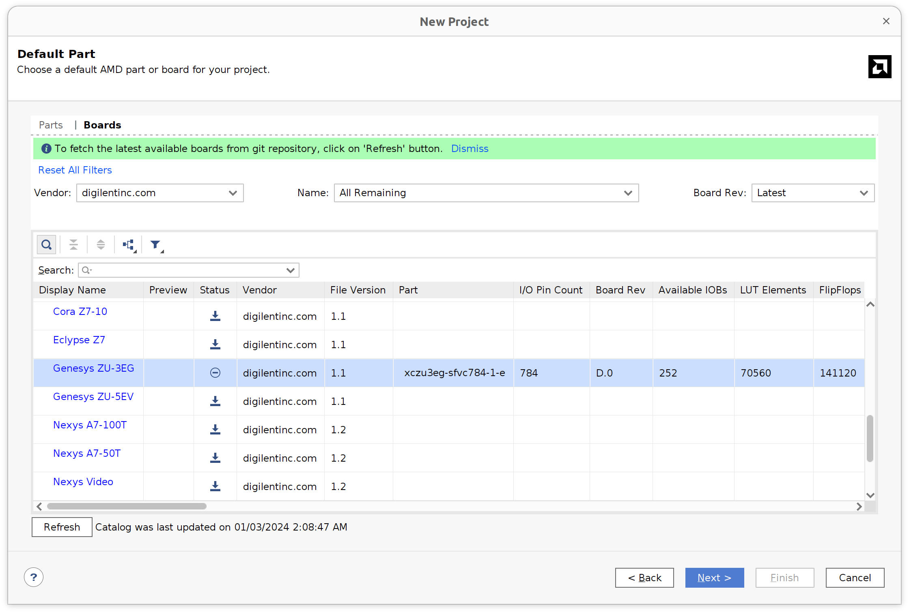
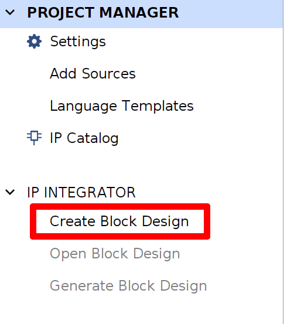
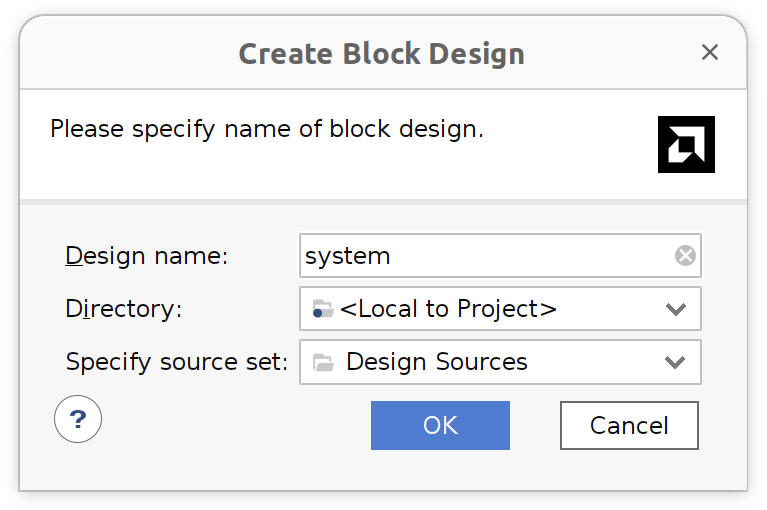
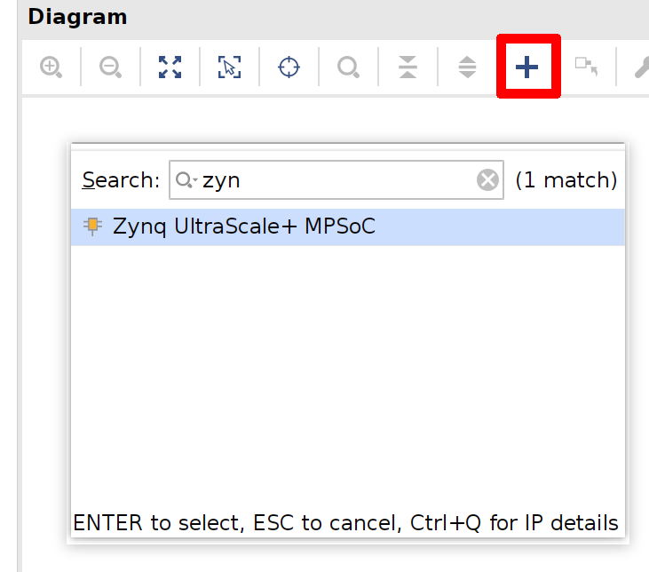
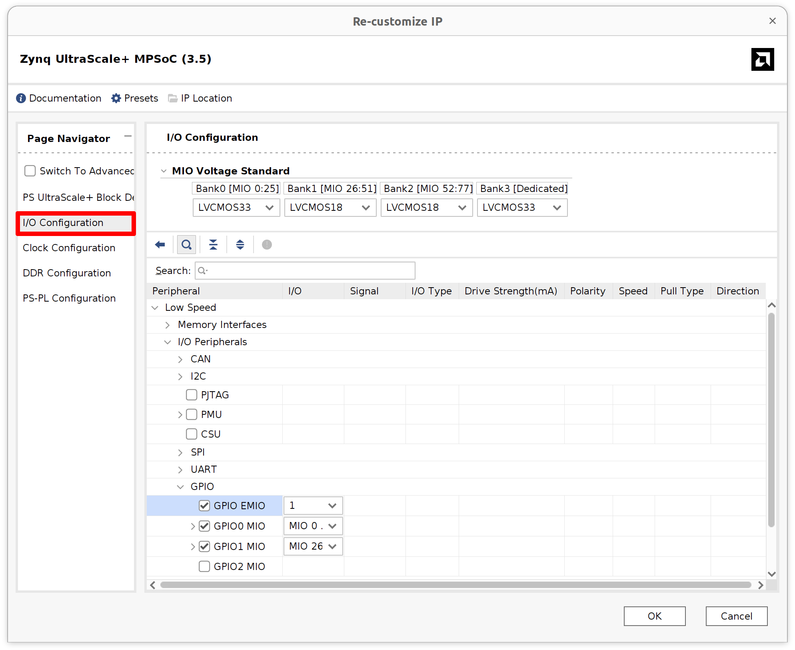
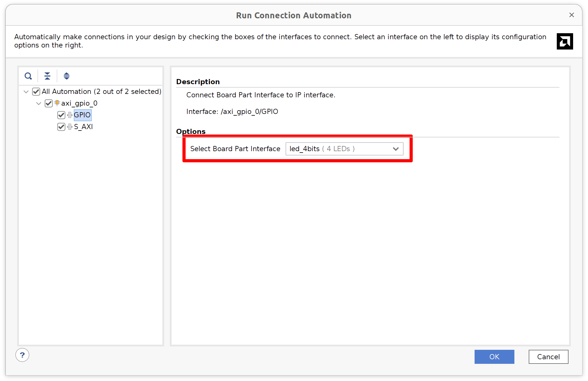
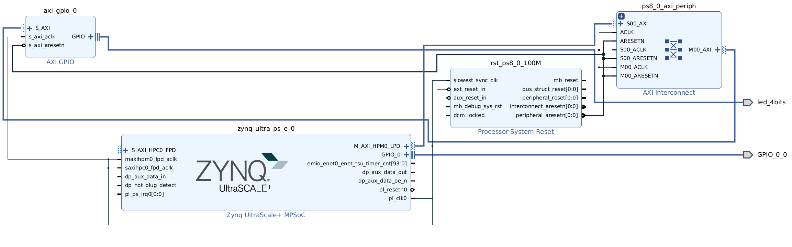
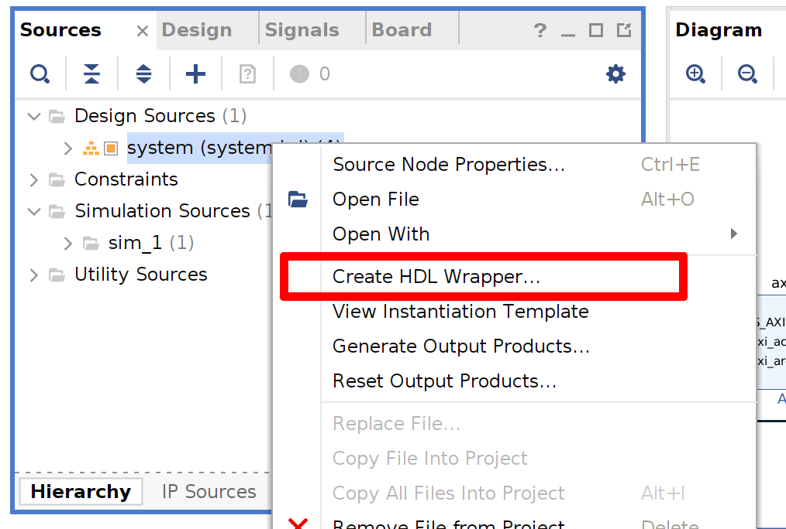

# BasicPetaLinux

GPIO LED 만을 사용한 기본 petalinux 예제입니다.

## 대상
### 소프트웨어

* Xilinx Vivado 2023.2
* PetaLinux 2023.2

### 하드웨어

* Genesys ZU 3EG Board : Zynq MPSoC

## Vivado 프로젝트 생성 및 빌드

`hw` 디렉토리에서 미리 생성된 프로젝트를 찾을 수 있습니다.

1. Vivado에서 새 RTL 프로젝트를 생성합니다.

생성 중 `Genesys ZU 3EG` 보드를 선택합니다. 해당 보드를 찾을 수 없는 경우, 갱신 버튼을 눌러서 항목을 먼저 갱신합니다.



2. 새 블럭 디자인 생성





3. Zynq MPSoC IP 추가

Zynq MPSoC IP를 추가하고 block automation 을 board preset으로 실행합니다. Zynq 블럭을 더블 클릭하여 1비트 GPIO EMIO를 추가해줍니다. 이것은 회로상 I2C mux reset pin으로 사용됩니다.




3. AXI GPIO IP 추가

AXI GPIO IP를 추가하고 block automation 을 GPIO (led 4bits), S_AXI (auto)로 실행합니다.



4. 남은 항목 연결

`saxihpc0_fpd_aclk` 을 `pl_clk0` 에 연결합니다. Zynq 블럭의 GPIO_0을 외부로 내보냅니다.



5. 블럭 디자인 검증

블럭 디자인 검증 버튼을 눌러서 오류를 미리 확인합니다.

6. HDL Wrapper 생성

Source 쪽의 design에서 우클릭하여 HDL Wrapper를 생성합니다.



7. Constraints 추가

`constratins/Genesys-ZU-3EG-D-Master.xdc` 파일을 사용하여 constratins를 추가합니다. I2C mux pin이 외부 pin의 이름과 일치하도록 주의합니다. GPIO LED pin은 내부적으로 처리되므로 constratins에 추가할 필요는 없습니다.

7. Bitstream 생성

8. 하드웨어 내보내기

`File/Export/Export Hardware`를  `Include bitstream` 옵션으로 실행합니다.

## PetaLinux 프로젝트 생성 및 빌드

`os` 디렉토리에서 미리 생성된 프로젝트를 찾을 수 있습니다.

1. 새 PetaLinux 프로젝트 생성

```
petalinux-create --type project --template zynqMP --name test_min
```

2. Export된 하드웨어로 프로젝트 설정

내보낸 xsa 디렉토리를 지정하여 설정을 실행합니다.

Run config with exported xsa directory.

```
petalinux-config --get-hw-description ../hw
```

`Auto Config Settings/Specify a manual device tree include directory` 옵션을 활성화하고 기본값인 `${STAGING_KERNEL_DIR}/include` 로 설정합니다.

tftp로 부팅을 위해서는 `Image Packaging Configuration/tftpboot directory`의 tftp 디렉토리를 `/srv/tftp` 로 변경합니다.

3. 사용자 device tree 파일 수정

빌드 전 `project-spec/meta-user/meta-xilinx-tools/recipes-bsp/uboot-device-tree/files/system-user.dtsi` 파일을 수정합니다. 아래 파일 내용은 https://github.com/Digilent/Genesys-ZU 의 내용을 기반으로 2023.2 에 맞게 수정되었습니다.

```
/include/ "system-conf.dtsi"
#include <dt-bindings/interrupt-controller/irq.h>
#include <dt-bindings/gpio/gpio.h>
#include <dt-bindings/media/xilinx-vip.h>
#include <dt-bindings/net/ti-dp83867.h>
#include <dt-bindings/phy/phy.h>
#include <dt-bindings/mux/mux.h>

/ {
};

&sdhci1 {
	disable-wp;
	xlnx,itap-delay-sd-hsd = <0x29>;
	xlnx,itap-delay-sd-ddr50 = <0x32>;
	xlnx,itap-delay-sdr25 = <0x2A>;
	xlnx,itap-delay-sdr50 = <0x1E>;
	xlnx,itap-delay-sdr104 = <0x0B>; //although auto-tuned, tuning fails on some cards if not set
};

/*
devicetree/bindings/net/macb.txt
devicetree/bindings/net/ti,dp83867.txt
devicetree/bindings/net/phy.txt
*/
&gem0 {
	phy-handle = <&phy0>;
	phy-mode = "rgmii-id";
	phy0: phy@15 {
		reg = <0x0F>;
		reset-gpios = <&gpio 44 GPIO_ACTIVE_LOW>;
		reset-assert-us = <1>;
		reset_deassert-us = <200>;
		interrupt-parent = <&gpio>;
		interrupts = <38 IRQ_TYPE_LEVEL_LOW>;
		ti,rx-internal-delay = <DP83867_RGMIIDCTL_2_00_NS>; //overwrites strap config
		ti,tx-internal-delay = <DP83867_RGMIIDCTL_1_50_NS>; //overwrites strap config
		ti,fifo-depth = <DP83867_PHYCR_FIFO_DEPTH_4_B_NIB>;
		ti,clk-output-sel = <DP83867_CLK_O_SEL_REF_CLK>;
	};
};

/*
Adding support for the mux and expose all 8 segments.
RESET# pin of TCA9548 is inverted on-board. Mapped to
EMIO[0] which is line 78.
devicetree/bindings/i2c/i2c-mux-pca954x.txt
devicetree/bindings/mux/mux-controller.txt
*/
&i2c0 {
	i2c-mux@70 {
		compatible = "nxp,pca9548";
		#address-cells = <1>;
		#size-cells = <0>;
		reg = <0x70>;
		reset-gpios = <&gpio 78 GPIO_ACTIVE_HIGH>;
		i2c-mux-idle-disconnect;
		idle-state = <MUX_IDLE_DISCONNECT>;
		i2c@0 {
			#address-cells = <1>;
			#size-cells = <0>;
			reg = <0>;
		};
		i2c@1 {
			#address-cells = <1>;
			#size-cells = <0>;
			reg = <1>;
		};
		i2c@2 {
			#address-cells = <1>;
			#size-cells = <0>;
			reg = <2>;
		};
		i2c@3 {
			#address-cells = <1>;
			#size-cells = <0>;
			reg = <3>;
			/* skip PMBUS */
		};
		i2c@4 {
			#address-cells = <1>;
			#size-cells = <0>;
			reg = <4>;
			eeprom@51 { /*FMC VITA 57.1 FRU*/
				compatible = "atmel,24c02";
				reg = <0x51>;
				pagesize = <1>; /* varies between models, so use a safe value */
			};
		};
		i2c@5 {
			#address-cells = <1>;
			#size-cells = <0>;
			reg = <5>;
			/* not sure if we should bind the eeprom driver to the SYZYGY DNA */
			eeprom@30 { /* SYZYGY DNA */
				compatible = "atmel,24c02";
				reg = <0x30>;
				read-only;
				address-width = <16>;
				size = <65536>; /*the whole 16-bit address range*/
			};
		};
		i2c@6 {
			#address-cells = <1>;
			#size-cells = <0>;
			reg = <6>;
		};
		i2c@7 {
			#address-cells = <1>;
			#size-cells = <0>;
			reg = <7>;
		};
	};
};

&spi0 {
	gpioexp: gpio@1 {
		compatible = "microchip,mcp23s08";
		gpio-controller;
		#reset-cells = <1>;
		#gpio-cells = <2>;
		interrupt-parent = <&gpio>;
		interrupts = <25 IRQ_TYPE_LEVEL_LOW>;
		microchip,spi-present-mask = <0x01>;
		interrupt-controller;
		#interrupt-cells = <0x2>;
		reg = <1>; /*SS[1]*/
		spi-max-frequency = <10000000>;
	};
};

&qspi {
	u-boot,dm-pre-reloc;
};

/* flash0 node is defined in system-conf by Petalinux */
&flash0 {
	compatible = "jedec,spi-nor";
	reg = <0>;
	spi-max-frequency = <80000000>; /* IS25LP256D max frequency for normal read 03h/13h */
	spi-tx-bus-width = <1>; /*TODO: Would quad write work?*/
	spi-rx-bus-width = <1>; /* Quad does not work in 2020.1 */
	/delete-node/ partition@0;
	/delete-node/ partition@1;
	/delete-node/ partition@2;
	partitions {
		compatible = "fixed-partitions";
		#address-cells = <1>;
		#size-cells = <1>;

		partition@0 {
        	        label = "boot";
        	        reg = <0x00000000 0x00100000>;
                };
		partition@1 {
                        label = "bootenv";
                        reg = <0x00100000 0x00040000>;
                };
		partition@2 {
                        label = "kernel";
                        reg = <0x00140000 0x01600000>;
                };
		partition@3 {
		        label = "board-id";
		        reg = <0x1FFF000 0x1000>;
			read-only;
		};
	};
};

&dwc3_0 {
	dr_mode = "host";
	snps,usb3_lpm_capable;
	snps,dis_u2_susphy_quirk ;
	snps,dis_u3_susphy_quirk ;
	maximum-speed = "super-speed";
};

&dwc3_1 {
	snps,dis_u2_susphy_quirk;
	snps,dis_u3_susphy_quirk;
	dr_mode = "host";
};

&ams_pl {
	xlnx,ext-channels {
		#address-cells = <1>;
		#size-cells = <0>;
		channel@0 {
			reg = <0>;
		};
		channel@5 {
			reg = <5>;
		};
		channel@6 {
			reg = <6>;
		};
		channel@7 {
			reg = <7>;
		};
		channel@8 {
			reg = <8>;
		};
	};
};

&gpio {
	gpio-line-names =
	"gpio0",
	"gpio1",
	"gpio2",
	"gpio3",
	"gpio4",
	"gpio5",
	"gpio6",
	"gpio7",
	"gpio8",
	"gpio9",
	"btn1",
	"btn0",
	"gpio12",
	"gpio13",
	"gpio14",
	"gpio15",
	"gpio16",
	"gpio17",
	"gpio18",
	"gpio19",
	"gpio20",
	"led0",
	"gpio22",
	"gpio23",
	"gpio24",
	"gpio25",
	"gpio26",
	"gpio27",
	"gpio28",
	"gpio29",
	"gpio30",
	"gpio31",
	"gpio32",
	"gpio33",
	"gpio34",
	"gpio35",
	"gpio36",
	"gpio37",
	"gpio38",
	"gpio39",
	"gpio40",
	"gpio41",
	"gpio42",
	"gpio43",
	"gpio44",
	"gpio45",
	"gpio46",
	"gpio47",
	"gpio48",
	"gpio49",
	"gpio50",
	"gpio51",
	"gpio52",
	"gpio53",
	"gpio54",
	"gpio55",
	"gpio56",
	"gpio57",
	"gpio58",
	"gpio59",
	"gpio60",
	"gpio61",
	"gpio62",
	"gpio63",
	"gpio64",
	"gpio65",
	"gpio66",
	"gpio67",
	"gpio68",
	"gpio69",
	"gpio70",
	"gpio71",
	"gpio72",
	"gpio73",
	"gpio74",
	"gpio75",
	"gpio76",
	"gpio77",
	"iic_mux_reset",
	"mipiA_pwup",
	"mipiB_pwup",
	"gpio81",
	"gpio82",
	"gpio83",
	"gpio84",
	"gpio85",
	"gpio86",
	"gpio87",
	"gpio88",
	"gpio89",
	"gpio90",
	"gpio91",
	"gpio92",
	"gpio93",
	"gpio94",
	"gpio95",
	"gpio96",
	"gpio97",
	"gpio98",
	"gpio99",
	"gpio100",
	"gpio101",
	"gpio102",
	"gpio103",
	"gpio104",
	"gpio105",
	"gpio106",
	"gpio107",
	"gpio108",
	"gpio109",
	"gpio110",
	"gpio111",
	"gpio112",
	"gpio113",
	"gpio114",
	"gpio115",
	"gpio116",
	"gpio117",
	"gpio118",
	"gpio119",
	"gpio120",
	"gpio121",
	"gpio122",
	"gpio123",
	"gpio124",
	"gpio125",
	"gpio126",
	"gpio127",
	"gpio128",
	"gpio129",
	"gpio130",
	"gpio131",
	"gpio132",
	"gpio133",
	"gpio134",
	"gpio135",
	"gpio136",
	"gpio137",
	"gpio138",
	"gpio139",
	"gpio140",
	"gpio141",
	"gpio142",
	"gpio143",
	"gpio144",
	"gpio145",
	"gpio146",
	"gpio147",
	"gpio148",
	"gpio149",
	"gpio150",
	"gpio151",
	"gpio152",
	"gpio153",
	"gpio154",
	"gpio155",
	"gpio156",
	"gpio157",
	"gpio158",
	"gpio159",
	"gpio160",
	"gpio161",
	"gpio162",
	"gpio163",
	"gpio164",
	"gpio165",
	"gpio166",
	"gpio167",
	"gpio168",
	"gpio169",
	"gpio170",
	"gpio171",
	"gpio172",
	"gpio173";

};

&axi_gpio_0 {
	gpio-line-names = "led1", "led2", "led3", "led4";
};
```

4. PetaLinux 빌드

```
petalinux-build
```

5. 부트 이미지 생성

```
petalinux-package --boot --force --fsbl images/linux/zynqmp_fsbl.elf --fpga images/linux/system.bit --u-boot
```

## SD 카드로 부팅하기

0. SD 카드 파티션 및 새 파일 시스템 생성

이전에 SD 카드를 준비한 적이 없다면, 파티션 및 새 파일 시스템을 먼저 생성합니다. `fdisk`, `parted`, `gparted` 등 어떠한 파티션 프로그램도 사용가능합니다.

파티션 프로그램에서 SD 카드 파티션을 제대로 인식하지 못한다면 `dd`를 사용하여 head 영역을 삭제할 필요가 있습니다.

첫번째 파티션은 512 MBytes FAT으로, 두번째 파티션은 남은 용량으로 ext4 로 생성합니다.

예를 들어 SD 카드가 /dev/sdc 라면 다음의 명령을 사용합니다.

```
sudo dd if=/dev/zero of=/dev/sdc bs=512 count=1024
sudo parted -s -a optimal -- /dev/sdc mklabel msdos mkpart primary fat32 1MiB 512MiB mkpart primary ext4 512MiB -1s
sudo mkfs.vfat /dev/sdc1
sudo mkfs.ext4 /dev/sdc2
```

1. 파티션 mount

OS 에서 자동적으로 mount한다면 이 단계를 생략합니다.

예를 들어 SD 카드가 /dev/sdc 라면 다음의 명령을 사용합니다.

```
sudo mount /dev/sdc1 /mnt/sd_card_vfat
sudo mount /dev/sdc2 /mnt/sd_card_ext4
```

2. 부트 파일 복사

BOOT.BIN, boot.scr, image.ub 파일을 SD카드의 FAT 파티션으로 복사합니다.

```
sudo cp images/linux/BOOT.BIN /mnt/sd_card_vfat/
sudo cp images/linux/boot.scr /mnt/sd_card_vfat/
sudo cp images/linux/image.ub /mnt/sd_card_vfat/
```

3. 루트 파일 복사

rootfs.tar.gz 파일을 SD 카드의 ext4 파티션에 풉니다.

```
sudo tar -xvzf images/linux/roofs.tar.gz -C /mnt/sd_card_ext4/
```

4. 파티션 unmount

5. SD 카드를 보드에 삽입

6. Micro USB를 보드에 연결

7. 시리얼 터미널 열기

이전에 부트 이미지에 암호를 설정한 적이 없다면 시리얼로 먼저 로그인해야 합니다.

minicom을 사용한다면 옵션에서 'Hardware Flow Control' 를 비활성화합니다.

```
sudo minicom -b 115200 -D /dev/ttyUSB1
```

8. 보드에 전원 넣기

보드의 부팅 점퍼는 미리 SD로 되어있어야 합니다.

9. Linux로 로그인

root 계정 로그인이 막혀있으므로 `petalinux` 계정으로 로그인 해야 합니다.

첫 로그인이라면 암호는 설정되어있지않고, 새 암호를 지정해야 합니다.

암호를 지정한 후에는 SSH로 로그인 할 수 있습니다.

## tftp 로 부팅하기

tftp를 사용하면 위의 복사 과정을 생략할 수 있습니다.

0. 환경 설정

세부 설정은 다음을 참고합니다: https://www.pixela.co.jp/products/pickup/dev/petalinux/p4_tftp.html

- tftpd-hpa 설치

```
sudo apt install tftpd-hpa
```

- tftpd-hpa 설정 편집

TFTP_OPTIONS 옵션을 `--secure --create` 로 변경합니다.

- 권한 조정

```
sudo chown -R tftp /srv/tftp
sudo chmod 777 /srv/tftp
```

- tftp-hpa 재시작

```
sudo service tftpd-hpa restart
```

- USB 케이블 드라이버를 설치한적이 없다면 설치

케이블 드라이버 설치 스크립트는 Vivado 설치 디렉토리의 `data/xicom/cable_drivers/lin64/install_script/install_drivers` 에서 찾을 수 있습니다.

1. 보드 부트 점퍼를 JTAG으로 변경

2. 시리얼 터미널 열기

minicom을 사용한다면 옵션에서 'Hardware Flow Control' 를 비활성화합니다.

```
sudo minicom -b 115200 -D /dev/ttyUSB1
```

3. 보드에 전원 넣기

SD 카드 상에 부트 이미지가 없도록 합니다. SD 카드에 부트 이미지가 있으면 해당 이미지로 부팅됩니다.

4. JTAG 부팅

```
petalinux-boot --jtag --u-boot
```

5. 부팅하기 위한 명령 실행

예를 들어 tftp 서버의 주소가 192.168.0.18 이면 다음과 같이 명령을 입력합니다.

```
setenv serverip 192.168.0.18
pxe get
pxe boot
```

6. Linux로 로그인

root 계정 로그인이 막혀있으므로 `petalinux` 계정으로 로그인 해야 합니다.

첫 로그인이라면 암호는 설정되어있지않고, 새 암호를 지정해야 합니다.

암호를 지정한 후에는 SSH로 로그인 할 수 있습니다.

tftp로 부팅 이후 이더넷 장치가 동작하지 않는다면, 다음의 명령으로 재활성화합니다.

```
sudo ifconfig eth0 down
sudo ifconfig eth0 up
```

## GPIO LED 제어

대상 장치를 찾기 위해서 `/sys/class/gpio` 를 확인합니다.

예를 들어 GPIO LED의 주소가 0x80000000 이므로, `gpiochip504`를 사용해야 합니다. 이 주소는 Vivado에서 하드웨어 프로젝트 생성 시 확인할 수 있습니다.

```
testmin:~$ ls -l /sys/class/gpio/                                                                                                                
total 0                                                                                                                                          
--w-------    1 root     root          4096 Jan  2 18:27 export                                                                                  
lrwxrwxrwx    1 root     root             0 Jan  2 18:26 gpiochip330 -> ../../devices/platform/axi/ff0a0000.gpio/gpio/gpiochip330                
lrwxrwxrwx    1 root     root             0 Jan  2 18:26 gpiochip504 -> ../../devices/platform/amba_pl@0/80000000.gpio/gpio/gpiochip504          
lrwxrwxrwx    1 root     root             0 Jan  2 18:26 gpiochip508 -> ../../devices/platform/firmware:zynqmp-firmware/firmware:zynqmp-firmware8
--w-------    1 root     root          4096 Jan  2 18:27 unexport     
```

root 권한으로 (`sudo su`), GPIO 4개를 내보내고 방향을 변경합니다.

```
echo -n 504 > /sys/class/gpio/export
echo -n 505 > /sys/class/gpio/export
echo -n 506 > /sys/class/gpio/export
echo -n 507 > /sys/class/gpio/export

echo -n out > /sys/class/gpio/gpio504/direction
echo -n out > /sys/class/gpio/gpio505/direction
echo -n out > /sys/class/gpio/gpio506/direction
echo -n out > /sys/class/gpio/gpio507/direction
```

root 권한으로 값을 설정하는 것으로 GPIO LED를 제어할 수 있습니다.

```
echo 1 > /sys/class/gpio/gpio504/value
echo 0 > /sys/class/gpio/gpio504/value

echo 1 > /sys/class/gpio/gpio505/value
echo 0 > /sys/class/gpio/gpio505/value
```
