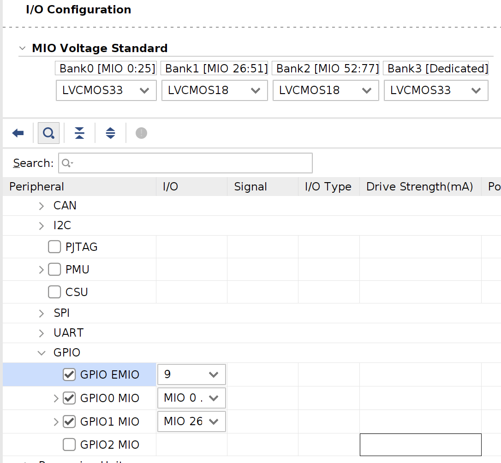

# PCAMPetaLinux

Pcam 5C petalinux example

## Target
### Software

* Xilinx Vivado 2023.2
* PetaLinux 2023.2

### Hardware

* Genesys ZU 3EG Board : Zynq MPSoC
* Pcam 5C Camera

## Create Vivado Project and Build

You can find prebuilt project in `hw` directory.

See [BasicPetaLinux](../BasicPetaLinux/README_ko.md) for base.

1. Create new RTL project in Vivado

2. Create new block design

3. Add Zynq MPSoC IP

After applying board preset, edit properties of Zynq block. Set 9-bit GPIO EMIO. The GPIO EMIO configuration is as follows.

* EMIO 0 (GPIO 78) : I2C mux reset
* EMIO 1 (GPIO 79) : MIPI A power
* EMIO 2 (GPIO 80) : MIPI CSI RX reset
* EMIO 3 (GPIO 81) : demosaic reset
* EMIO 4 (GPIO 82) : gamma LUT reset
* EMIO 5 (GPIO 83) : Video processing CSC reset
* EMIO 6 (GPIO 84) : Video frame buffer write reset
* EMIO 7 (GPIO 85) : ov5640 power down
* EMIO 8 (GPIO 86) : ov5640 reset



Change the PL clock output as follows. The second clock (PL1) is used for DPHY 200MHz.


3. Full block configuration

For complete block configuration, see [output file](doc/system.pdf).

MIPI CSI2 RX -> demosaic -> gamma LUT -> CSC -> Video frame buffer write

- EMIO 0, 1 are exported externally with Slice. The name must match to constraints.

- Add MIPI CSI-2 RX IP. Connect EMIO to reset with Slice and connect pl_clk1 to DPHY 200MHz. Video clock connects to pl_clk0. Set the properties as follows.


- Add Demosaic IP. Connect EMIO to reset with Slice. Set the properties as follows.


- Add Gamma LUT IP. Connect EMIO to reset with Slice. Set the properties as follows.


- Add Video processing subsystem IP. Connect EMIO to reset with Slice. Set the properties as follows.


- Add Video frame buffer write IP. Connect EMIO to reset with Slice. Set the properties as follows.


4. Connect the remaining

Connect and process remaining items through automation, etc.

5. Validate block design

6. Create HDL Wrapper

7. Add constraints

Add constraints using `constraints/Genesys-ZU-3EG-D-Master.xdc`. Make sure I2C mux pin, MIPI A power pin match to names in external pin.

8. Generate bitstream

9. Export hardware

## Create PetaLinux Project and Build

You can find prebuilt project in `os` directory.

See [BasicPetaLinux](../BasicPetaLinux/README_ko.md) for base.

1. Create new PetaLinux project

2. Configure project with exported hardware

3. Configure rootfs

Enter rootfs configuration with the following command.

```
petalinux-config -c rootfs
```

Select the following items from rootfs. Select additional items as you require.

* Filesystem Packages/base/i2c-tools
* Filesystem Packages/misc/v4l-utils
* Filesystem Packages/misc/yavta

4. kernel configuration

Enter kernel configuration with the following command.

```
petalinux-config -c kernel
```

In kernel configuration, select the following items.

* Device Drivers/Multimedia support/Media ancillary drivers/Camera sensor device/OmniVision OV5640 sensor support

Uncheck the following items in kernel configuration. If the following items are slected, the driver will intercept and capture will not be possible. 

* Device Drivers/Graphic support/Xilinx DRM CSC Driver
* Device Drivers/Graphic support/Xilinx DRM Scaler Driver

5. Edit user device tree file

Edit `project-spec/meta-user/meta-xilinx-tools/recipes-bsp/uboot-device-tree/files/system-user.dtsi` before building. The file contents below have been modified to match the EMIO and other settings.

Review the `components/plnx_workspace/device-tree/device-tree/pl.dtsi` file that automatically generated after the PetaLinux build, and edit user device tree file again if modifications are necessary.

```
/include/ "system-conf.dtsi"
#include <dt-bindings/interrupt-controller/irq.h>
#include <dt-bindings/gpio/gpio.h>
#include <dt-bindings/media/xilinx-vip.h>
#include <dt-bindings/net/ti-dp83867.h>
#include <dt-bindings/phy/phy.h>
#include <dt-bindings/mux/mux.h>

// GPIO 78 : I2C mux reset
// GPIO 79 : MIPI A power
// GPIO 80 : MIPI CSI RX
// GPIO 81 : demosaic
// GPIO 82 : gamma
// GPIO 83 : vp csc
// GPIO 84 : vframe buffer write
// GPIO 85 : ov5640 power down
// GPIO 86 : ov5640 reset

/ {
	pcam_clk: pcam_clk {
		#clock-cells = <0>;
		compatible = "fixed-clock";
		clock-frequency = <12000000>;
	};

	DOVDD: fixed_regulator_DOVDD@0 {
		compatible = "regulator-fixed";
		regulator-name = "DOVDD_reg";
		regulator-min-microvolt = <1800000>;
		regulator-max-microvolt = <1800000>;
		/* MIPI A power */
		gpio = <&gpio 79 GPIO_ACTIVE_HIGH>;
		startup-delay-us = <50000>;
		enable-active-high;
	};

	AVDD: fixed_regulator_AVDD@1 {
		compatible = "regulator-fixed";
		regulator-name = "AVDD_reg";
		regulator-min-microvolt = <2800000>;
		regulator-max-microvolt = <2800000>;
	};

	DVDD: fixed_regulator_DVDD@2 {
		compatible = "regulator-fixed";
		regulator-name = "DVDD_reg";
		regulator-min-microvolt = <1500000>;
		regulator-max-microvolt = <1500000>;
	};
};

&pinctrl0 {
	status = "okay";

	pinctrl_i2c0_default: i2c0-default {
		mux {
			groups = "i2c0_5_grp"; /* MIO22, MIO23 */
			function = "i2c0";
		};

		conf {
			groups = "i2c0_5_grp";
			bias-pull-up;
			slew-rate = <0>;
			io-standard = <1>;
		};
	};

	pinctrl_i2c1_default: i2c1-default {
		mux {
			groups = "i2c1_2_grp"; /* MIO8, MIO 9 */
			function = "i2c1";
		};

		conf {
			groups = "i2c1_2_grp";
			bias-pull-up;
			slew-rate = <0>;
			io-standard = <1>;
		};
	};
};

&sdhci1 {
	disable-wp;
	xlnx,itap-delay-sd-hsd = <0x29>;
	xlnx,itap-delay-sd-ddr50 = <0x32>;
	xlnx,itap-delay-sdr25 = <0x2A>;
	xlnx,itap-delay-sdr50 = <0x1E>;
	xlnx,itap-delay-sdr104 = <0x0B>; //although auto-tuned, tuning fails on some cards if not set
};

/*
devicetree/bindings/net/macb.txt
devicetree/bindings/net/ti,dp83867.txt
devicetree/bindings/net/phy.txt
*/
&gem0 {
	phy-handle = <&phy0>;
	phy-mode = "rgmii-id";
	phy0: phy@15 {
		reg = <0x0F>;
		reset-gpios = <&gpio 44 GPIO_ACTIVE_LOW>;
		reset-assert-us = <1>;
		reset_deassert-us = <200>;
		interrupt-parent = <&gpio>;
		interrupts = <38 IRQ_TYPE_LEVEL_LOW>;
		ti,rx-internal-delay = <DP83867_RGMIIDCTL_2_00_NS>; //overwrites strap config
		ti,tx-internal-delay = <DP83867_RGMIIDCTL_1_50_NS>; //overwrites strap config
		ti,fifo-depth = <DP83867_PHYCR_FIFO_DEPTH_4_B_NIB>;
		ti,clk-output-sel = <DP83867_CLK_O_SEL_REF_CLK>;
	};
};

/*
Adding support for the mux and expose all 8 segments.
RESET# pin of TCA9548 is inverted on-board. Mapped to
EMIO[0] which is line 78.
devicetree/bindings/i2c/i2c-mux-pca954x.txt
devicetree/bindings/mux/mux-controller.txt
*/
&i2c0 {
	pinctrl-names = "default";
	pinctrl-0 = <&pinctrl_i2c0_default>;

	i2c-mux@70 {
		compatible = "nxp,pca9548";
		#address-cells = <1>;
		#size-cells = <0>;
		reg = <0x70>;
		reset-gpios = <&gpio 78 GPIO_ACTIVE_HIGH>;
		i2c-mux-idle-disconnect;
		idle-state = <MUX_IDLE_DISCONNECT>;
		i2c@0 {
			#address-cells = <1>;
			#size-cells = <0>;
			reg = <0>;

			ov5640: camera@3c {
				compatible = "ovti,ov5640";
		                reg = <0x3c>;
		                clocks = <&pcam_clk>;
		                clock-names = "xclk";
		                DOVDD-supply = <&DOVDD>; /* 1.8v */
		                AVDD-supply = <&AVDD>;  /* 2.8v */
		                DVDD-supply = <&DVDD>;  /* 1.5v */

		                powerdown-gpios = <&gpio 85 GPIO_ACTIVE_HIGH>;
		                reset-gpios = <&gpio 86 GPIO_ACTIVE_HIGH>;
		                port {
			        	ov5640_to_mipi_csi2: endpoint {
				                     remote-endpoint = <&mipi_csi_inmipi_csi2_rx_subsyst_0>;
				                     clock-lanes = <0>;
				                     data-lanes = <1 2>;
					};
				};
			};
		};
		i2c@1 {
			#address-cells = <1>;
			#size-cells = <0>;
			reg = <1>;
		};
		i2c@2 {
			#address-cells = <1>;
			#size-cells = <0>;
			reg = <2>;
		};
		i2c@3 {
			#address-cells = <1>;
			#size-cells = <0>;
			reg = <3>;
                        /* PMBUS */
		};
		i2c@4 {
			#address-cells = <1>;
			#size-cells = <0>;
			reg = <4>;
			eeprom@51 { /*FMC VITA 57.1 FRU*/
				compatible = "atmel,24c02";
				reg = <0x51>;
				pagesize = <1>; /* varies between models, so use a safe value */
			};
		};
		i2c@5 {
			#address-cells = <1>;
			#size-cells = <0>;
			reg = <5>;
			/* not sure if we should bind the eeprom driver to the SYZYGY DNA */
			eeprom@30 { /* SYZYGY DNA */
				compatible = "atmel,24c02";
				reg = <0x30>;
				read-only;
				address-width = <16>;
				size = <65536>; /*the whole 16-bit address range*/
			};
		};
		i2c@6 {
			#address-cells = <1>;
			#size-cells = <0>;
			reg = <6>;
		};
		i2c@7 {
			#address-cells = <1>;
			#size-cells = <0>;
			reg = <7>;
		};
	};
};

&i2c1 {
	pinctrl-names = "default";
	pinctrl-0 = <&pinctrl_i2c1_default>;
};

&spi0 {
	gpioexp: gpio@1 {
		compatible = "microchip,mcp23s08";
		gpio-controller;
		#reset-cells = <1>;
		#gpio-cells = <2>;
		interrupt-parent = <&gpio>;
		interrupts = <25 IRQ_TYPE_LEVEL_LOW>;
		microchip,spi-present-mask = <0x01>;
		interrupt-controller;
		#interrupt-cells = <0x2>;
		reg = <1>; /*SS[1]*/
		spi-max-frequency = <10000000>;
	};
};

&qspi {
	u-boot,dm-pre-reloc;
};

/* flash0 node is defined in system-conf by Petalinux */
&flash0 {
	compatible = "jedec,spi-nor";
	reg = <0>;
	spi-max-frequency = <80000000>; /* IS25LP256D max frequency for normal read 03h/13h */
	spi-tx-bus-width = <1>; /*TODO: Would quad write work?*/
	spi-rx-bus-width = <1>; /* Quad does not work in 2020.1 */
	/delete-node/ partition@0;
	/delete-node/ partition@1;
	/delete-node/ partition@2;
	partitions {
		compatible = "fixed-partitions";
		#address-cells = <1>;
		#size-cells = <1>;

		partition@0 {
        	        label = "boot";
        	        reg = <0x00000000 0x00100000>;
                };
		partition@1 {
                        label = "bootenv";
                        reg = <0x00100000 0x00040000>;
                };
		partition@2 {
                        label = "kernel";
                        reg = <0x00140000 0x01600000>;
                };
		partition@3 {
		        label = "board-id";
		        reg = <0x1FFF000 0x1000>;
			read-only;
		};
	};
};

&dwc3_0 {
	dr_mode = "host";
	snps,usb3_lpm_capable;
	snps,dis_u2_susphy_quirk ;
	snps,dis_u3_susphy_quirk ;
	maximum-speed = "super-speed";
};

&dwc3_1 {
	snps,dis_u2_susphy_quirk;
	snps,dis_u3_susphy_quirk;
	dr_mode = "host";
};

&ams_pl {
	xlnx,ext-channels {
		#address-cells = <1>;
		#size-cells = <0>;
		channel@0 {
			reg = <0>;
		};
		channel@5 {
			reg = <5>;
		};
		channel@6 {
			reg = <6>;
		};
		channel@7 {
			reg = <7>;
		};
		channel@8 {
			reg = <8>;
		};
	};
};

&gpio {
	gpio-line-names =
	"gpio0",
	"gpio1",
	"gpio2",
	"gpio3",
	"gpio4",
	"gpio5",
	"gpio6",
	"gpio7",
	"gpio8",
	"gpio9",
	"btn1",
	"btn0",
	"gpio12",
	"gpio13",
	"gpio14",
	"gpio15",
	"gpio16",
	"gpio17",
	"gpio18",
	"gpio19",
	"gpio20",
	"led0",
	"gpio22",
	"gpio23",
	"gpio24",
	"gpio25",
	"gpio26",
	"gpio27",
	"gpio28",
	"gpio29",
	"gpio30",
	"gpio31",
	"gpio32",
	"gpio33",
	"gpio34",
	"gpio35",
	"gpio36",
	"gpio37",
	"gpio38",
	"gpio39",
	"gpio40",
	"gpio41",
	"gpio42",
	"gpio43",
	"gpio44",
	"gpio45",
	"gpio46",
	"gpio47",
	"gpio48",
	"gpio49",
	"gpio50",
	"gpio51",
	"gpio52",
	"gpio53",
	"gpio54",
	"gpio55",
	"gpio56",
	"gpio57",
	"gpio58",
	"gpio59",
	"gpio60",
	"gpio61",
	"gpio62",
	"gpio63",
	"gpio64",
	"gpio65",
	"gpio66",
	"gpio67",
	"gpio68",
	"gpio69",
	"gpio70",
	"gpio71",
	"gpio72",
	"gpio73",
	"gpio74",
	"gpio75",
	"gpio76",
	"gpio77",
	"iic_mux_reset",
	"mipiA_pwup",
	"mipiB_pwup",
	"gpio81",
	"gpio82",
	"gpio83",
	"gpio84",
	"gpio85",
	"gpio86",
	"gpio87",
	"gpio88",
	"gpio89",
	"gpio90",
	"gpio91",
	"gpio92",
	"gpio93",
	"gpio94",
	"gpio95",
	"gpio96",
	"gpio97",
	"gpio98",
	"gpio99",
	"gpio100",
	"gpio101",
	"gpio102",
	"gpio103",
	"gpio104",
	"gpio105",
	"gpio106",
	"gpio107",
	"gpio108",
	"gpio109",
	"gpio110",
	"gpio111",
	"gpio112",
	"gpio113",
	"gpio114",
	"gpio115",
	"gpio116",
	"gpio117",
	"gpio118",
	"gpio119",
	"gpio120",
	"gpio121",
	"gpio122",
	"gpio123",
	"gpio124",
	"gpio125",
	"gpio126",
	"gpio127",
	"gpio128",
	"gpio129",
	"gpio130",
	"gpio131",
	"gpio132",
	"gpio133",
	"gpio134",
	"gpio135",
	"gpio136",
	"gpio137",
	"gpio138",
	"gpio139",
	"gpio140",
	"gpio141",
	"gpio142",
	"gpio143",
	"gpio144",
	"gpio145",
	"gpio146",
	"gpio147",
	"gpio148",
	"gpio149",
	"gpio150",
	"gpio151",
	"gpio152",
	"gpio153",
	"gpio154",
	"gpio155",
	"gpio156",
	"gpio157",
	"gpio158",
	"gpio159",
	"gpio160",
	"gpio161",
	"gpio162",
	"gpio163",
	"gpio164",
	"gpio165",
	"gpio166",
	"gpio167",
	"gpio168",
	"gpio169",
	"gpio170",
	"gpio171",
	"gpio172",
	"gpio173";

};

&mipi_csi2_rx_subsyst_0 {
        xlnx,csi-pxl-format = <0x2a>; // RAW8
};

&mipi_csi_inmipi_csi2_rx_subsyst_0 {
        data-lanes = <1 2>;
        remote-endpoint =<&ov5640_to_mipi_csi2>;
};

&csc_port1v_proc_ss_csc {
        xlnx,video-format = <XVIP_VF_RBG>; // csc out -> vframe
};

&csc_port0v_proc_ss_csc {
        xlnx,video-format = <XVIP_VF_RBG>; // gamma -> csc in
};
```

6. Build PetaLinux

7. Create boot image

8. Connect camera

9. Power the board and boot

## Camera capture

You can find the `/dev/video0` and `/dev/media0` devices if probed properly. If is is not probed, review the kernel configuration and device tree.

Following commands are need to be executed with root privileges. Verify the entire configuration with the following command.

```
media-ctrl -p
```

It will look like this if probed properly.

```
Media controller API version 6.1.30

Media device information
------------------------
driver          xilinx-video
model           Xilinx Video Composite Device
serial          
bus info        platform:amba_pl@0:vcap_v_proc_
hw revision     0x0
driver version  6.1.30

Device topology
- entity 1: vcap_v_proc_ss_csc output 0 (1 pad, 1 link)
            type Node subtype V4L flags 0
            device node name /dev/video0
        pad0: Sink
                <- "80040000.v_proc_ss":1 [ENABLED]

- entity 5: 80000000.mipi_csi2_rx_subsystem (2 pads, 2 links)
            type V4L2 subdev subtype Unknown flags 0
            device node name /dev/v4l-subdev0
        pad0: Sink
                [fmt:SRGGB8_1X8/1920x1080 field:none colorspace:srgb]
                <- "ov5640 2-003c":0 [ENABLED]
        pad1: Source
                [fmt:SRGGB8_1X8/1920x1080 field:none colorspace:srgb]
                -> "80010000.v_demosaic":0 [ENABLED]

- entity 8: 80010000.v_demosaic (2 pads, 2 links)
            type V4L2 subdev subtype Unknown flags 0
            device node name /dev/v4l-subdev1
        pad0: Sink
                [fmt:SRGGB8_1X8/1280x720 field:none colorspace:srgb]
                <- "80000000.mipi_csi2_rx_subsystem":1 [ENABLED]
        pad1: Source
                [fmt:RBG888_1X24/1280x720 field:none colorspace:srgb]
                -> "80030000.v_gamma_lut":0 [ENABLED]

- entity 11: 80030000.v_gamma_lut (2 pads, 2 links)
             type V4L2 subdev subtype Unknown flags 0
             device node name /dev/v4l-subdev2
        pad0: Sink
                [fmt:RBG888_1X24/1280x720 field:none colorspace:srgb]
                <- "80010000.v_demosaic":1 [ENABLED]
        pad1: Source
                [fmt:RBG888_1X24/1280x720 field:none colorspace:srgb]
                -> "80040000.v_proc_ss":0 [ENABLED]

- entity 14: 80040000.v_proc_ss (2 pads, 2 links)
             type V4L2 subdev subtype Unknown flags 0
             device node name /dev/v4l-subdev3
        pad0: Sink
                [fmt:RBG888_1X24/1280x720 field:none colorspace:rec709]
                <- "80030000.v_gamma_lut":1 [ENABLED]
        pad1: Source
                [fmt:RBG888_1X24/1280x720 field:none colorspace:rec709]
                -> "vcap_v_proc_ss_csc output 0":0 [ENABLED]

- entity 17: ov5640 2-003c (1 pad, 1 link)
             type V4L2 subdev subtype Sensor flags 0
             device node name /dev/v4l-subdev4
        pad0: Source
                [fmt:UYVY8_2X8/640x480@1/30 field:none colorspace:srgb xfer:srgb ycbcr:601 quantization:full-range
                 crop.bounds:(0,0)/2624x1964
                 crop:(16,14)/2592x1944]
                -> "80000000.mipi_csi2_rx_subsystem":0 [ENABLED]
```

Configure resolution and color format with the follwing commands.

```
media-ctl -d /dev/media0 -v -V "\"ov5640 2-003c\":0 [fmt:SRGGB8_1X8/1280x720 field:none]"
media-ctl -d /dev/media0 -v -V "\"80000000.mipi_csi2_rx_subsystem\":0 [fmt:SRGGB8_1X8/1280x720 field:none]"
media-ctl -d /dev/media0 -v -V "\"80000000.mipi_csi2_rx_subsystem\":1 [fmt:SRGGB8_1X8/1280x720 field:none]"
media-ctl -d /dev/media0 -v -V "\"80010000.v_demosaic\":0 [fmt:SRGGB8_1X8/1280x720 field:none]"
media-ctl -d /dev/media0 -v -V "\"80010000.v_demosaic\":1 [fmt:RBG888_1X24/1280x720 field:none]"
media-ctl -d /dev/media0 -v -V "\"80030000.v_gamma_lut\":0 [fmt:RBG888_1X24/1280x720 field:none]"
media-ctl -d /dev/media0 -v -V "\"80030000.v_gamma_lut\":1 [fmt:RBG888_1X24/1280x720 field:none]"
media-ctl -d /dev/media0 -v -V "\"80040000.v_proc_ss\":0 [fmt:RBG888_1X24/1280x720 field:none]"
media-ctl -d /dev/media0 -v -V "\"80040000.v_proc_ss\":1 [fmt:RBG888_1X24/1280x720 field:none]"
```

Check the supported formats of `/dev/video0` with the following command.

```
yavta --enum-formats /dev/video0
```

It will look like this if probed properly.

```
Device /dev/video0 opened.
Device `vcap_v_proc_ss_csc output 0' on `platform:vcap_v_proc_ss_csc:0' (driver 'xilinx-vipp') supports video, capture, with mplanes.
- Available formats:
        Format 0: RGB24 (33424752)
        Type: Video capture mplanes (9)
        Name: 24-bit RGB 8-8-8

Video format: YUYV (56595559) 1920x0 field none, 0 planes: 
```

Capture with the following command and save it as a file.

```
yavta -n 3 -c10 -f RGB24 -s 1280x720 --skip 7 -F /dev/video0
```

It will look like this if work properly.

```
Device /dev/video0 opened.
Device `vcap_v_proc_ss_csc output 0' on `platform:vcap_v_proc_ss_csc:0' (driver 'xilinx-vipp') supports video, capture, with mplanes.
Video format set: RGB24 (33424752) 1280x720 field none, 1 planes: 
 * Stride 3840, buffer size 2764800
Video format: RGB24 (33424752) 1280x720 field none, 1 planes: 
 * Stride 3840, buffer size 2764800
3 buffers requested.
length: 1 offset: 3593392984 timestamp type/source: mono/EoF
Buffer 0/0 mapped at address 0xffffb03bd000.
length: 1 offset: 3593392984 timestamp type/source: mono/EoF
Buffer 1/0 mapped at address 0xffffb011a000.
length: 1 offset: 3593392984 timestamp type/source: mono/EoF
Buffer 2/0 mapped at address 0xffffafe77000.
0 (0) [-] none 0 2764800 B 305.285052 305.285067 5.557 fps ts mono/EoF
1 (1) [-] none 1 2764800 B 305.318083 305.318094 30.275 fps ts mono/EoF
2 (2) [-] none 2 2764800 B 305.351115 305.351126 30.274 fps ts mono/EoF
3 (0) [-] none 3 2764800 B 305.384147 305.384158 30.274 fps ts mono/EoF
4 (1) [-] none 4 2764800 B 305.417179 305.417189 30.274 fps ts mono/EoF
5 (2) [-] none 5 2764800 B 305.450211 305.450221 30.274 fps ts mono/EoF
6 (0) [-] none 6 2764800 B 305.483243 305.483253 30.274 fps ts mono/EoF
7 (1) [-] none 7 2764800 B 305.516275 305.516285 30.274 fps ts mono/EoF
8 (2) [-] none 8 2764800 B 305.549309 305.561894 30.272 fps ts mono/EoF
9 (0) [-] none 9 2764800 B 305.582339 305.607783 30.276 fps ts mono/EoF
Captured 10 frames in 0.502684 seconds (19.893205 fps, 0.000000 B/s).
3 buffers released.
```
Transfer the file to the PC using `sftp`, etc and check the image. To convert with ImageMagick, install `imagemagick-6.q16` in advance and perform the conversion with the following command.

```
convert -size 1280x720 -depth 8 RGB:frame-000008.bin cam.png
```


## Limitations

* ov5640 driver does not support RAW10 format.
* ov5640 driver support at least 1280x720 at 8bpp.
* ov5640 driver only supports up to 1280x720 at 24bpp.

## TODO

### YUV420, YUV422 output for terminal

When output is set to YUV420 or YUV422 at the end, a `Stream Buffer Full` error occurs.

### Different resoltion

* 2592x1944 RAW8 : Problem with only white screen being captured
* 1280x960 RAW8 : `Broken pipe` error occurred
* 1920x1080 RAW8 : Problem with only abnormal screen being captured

### Capture image quality
