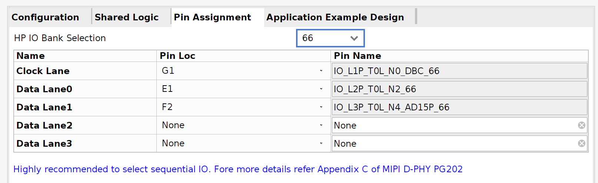
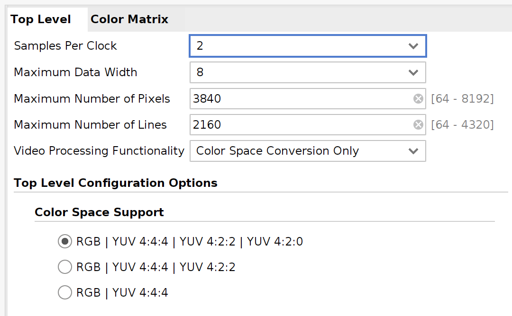
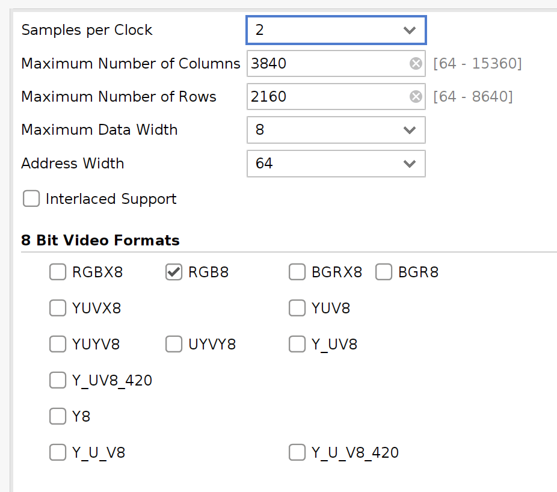

# PCAMPetaLinux

Pcam 5C 를 사용한 petalinux 예제입니다.

## 대상
### 소프트웨어

* Xilinx Vivado 2023.2
* PetaLinux 2023.2

### 하드웨어

* Genesys ZU 3EG Board : Zynq MPSoC
* Pcam 5C Camera (https://digilent.com/shop/pcam-5c-5-mp-fixed-focus-color-camera-module/)

## Vivado 프로젝트 생성 및 빌드

`hw` 디렉토리에서 미리 생성된 프로젝트를 찾을 수 있습니다.

기본적인 생성 방법은 [BasicPetaLinux](../BasicPetaLinux/README_ko.md) 을 참고합니다.

### 1. 새 RTL 프로젝트 생성

### 2. 새 블럭 디자인 생성

### 3. Zynq MPSoc IP 추가

Board preset으로 자동화한 후, 블럭을 더블 클릭하여 수정합니다. 5비트 GPIO EMIO를 설정합니다. 전체 GPIO EMIO 구성은 다음과 같습니다.

* EMIO 0 (GPIO 78) : I2C mux reset
* EMIO 1 (GPIO 79) : MIPI A power
* EMIO 2 (GPIO 80) : MIPI CSI RX reset
* EMIO 3 (GPIO 81) : Video processing CSC reset
* EMIO 4 (GPIO 82) : Video frame buffer write reset


PL 클럭 출력을 다음과 같이 변경합니다. 두번째 클럭(PL1)은 DPHY 200MHz에 사용됩니다. 


### 4. 전체 블럭 구성

전체 블럭 구성은 [출력 파일](doc/system2.pdf)을 참고합니다.

MIPI CSI2 RX -> CSC -> Video frame buffer write

- Slice을 통하여 EMIO 0, 1을 외부로 내보냅니다. 이름은 추후 constraints 와 일치하여야 합니다.

- MIPI CSI2 RX를 추가합니다. EMIO를 slice를 통하여 reset에 연결하고, pl_clk1을 DPHY 200MHz에 연결합니다. Video clock은 pl_clk0 에 연결합니다. 속성을 다음과 같이 설정합니다.




- AXI4-Stream Subset Converter를 추가합니다. 속성을 다음과 같이 설정합니다.


- Video processing subsystem을 추가합니다. EMIO를 slice를 통하여 reset에 연결합니다. 속성을 다음과 같이 설정합니다.




- Video frame buffer write를 추가합니다. EMIO를 slice를 통하여 reset에 연결합니다. 속성을 다음과 같이 설정합니다.



### 5. 남은 항목 연결

Automation 등을 통하여 남은 항목을 연결하고 처리합니다.

### 6. 블럭 디자인 검증

### 7. HDL wrapper 생성

### 8. Constraints 추가

`constraints/Genesys-ZU-3EG-D-Master.xdc` 파일을 사용하여 constratins를 추가합니다. I2C mux pin, MIPI A power 외부 pin 이름과 일치하도록 주의합니다.

### 9. Bitstream 생성

### 10. 하드웨어 내보내기

## PetaLinux 프로젝트 생성 및 빌드

`os` 디렉토리에서 미리 생성된 프로젝트를 찾을 수 있습니다.

기본적인 생성 방법은 [BasicPetaLinux](../BasicPetaLinux/README_ko.md) 을 참고합니다.

### 1. 새 PetaLinux 프로젝트 생성

### 2. Export된 하드웨어로 프로젝트 설정

### 3. rootfs 설정

다음 명령으로 rootfs 설정에 진입합니다.

```
petalinux-config -c rootfs
```

rootfs에서 다음의 항목을 선택합니다. 추가로 필요한 항목이 있으면 선택합니다.

* Filesystem Packages/base/i2c-tools
* Filesystem Packages/misc/v4l-utils
* Filesystem Packages/misc/yavta

### 4. 커널 설정

다음 명령으로 커널 설정에 진입합니다.

```
petalinux-config -c kernel
```

커널 설정에서 다음 항목을 추가로 선택합니다.

* Device Drivers/Multimedia support/Media ancillary drivers/Camera sensor device/OmniVision OV5640 sensor support

커널 설정에서 다음 항목을 선택 해제합니다. 다음 항목이 선택되어있으면 해당 드라이버가 미리 가로채서 캡쳐를 구동시킬 수 없습니다.

* Device Drivers/Graphic support/Xilinx DRM CSC Driver
* Device Drivers/Graphic support/Xilinx DRM Scaler Driver

### 5. 사용자 device tree 파일 수정

빌드 전 `project-spec/meta-user/meta-xilinx-tools/recipes-bsp/uboot-device-tree/files/system-user.dtsi` 파일을 수정합니다. 아래 파일 내용은 위의 EMIO 및 전체 설정에 맞게 수정되었습니다.

PetaLinux 빌드 이후 자동으로 생성된 `components/plnx_workspace/device-tree/device-tree/pl.dtsi` 파일을 검토하고, 수정이 필요한 경우 다시 수정합니다.

* [system-user.dtsi](os/project-spec/meta-user/recipes-bsp/device-tree/files/system-user.dtsi)

### 6. PetaLinux 빌드

### 7. 부트 이미지 생성

### 8. 카메라 연결

### 9. 전원 및 부팅

## 카메라 캡쳐

정상적으로 인식된 경우 `/dev/video0` 와 `/dev/media0` 장치를 찾을 수 있습니다. 만약 인식되지 않는 경우 커널 설정과 device tree를 검토합니다.

이후 명령들은 root 권한으로 실행합니다. 다음 명령으로 전체 구성을 확인합니다.

```
media-ctl -p
```

정상적인 경우 다음과 같이 표시됩니다.

```
Media controller API version 6.1.30

Media device information
------------------------
driver          xilinx-video
model           Xilinx Video Composite Device
serial
bus info        platform:amba_pl@0:vcap_v_proc_
hw revision     0x0
driver version  6.1.30

Device topology
- entity 1: vcap_v_proc_ss_csc output 0 (1 pad, 1 link)
            type Node subtype V4L flags 0
            device node name /dev/video0
        pad0: Sink
                <- "80040000.v_proc_ss":1 [ENABLED]

- entity 5: 80000000.mipi_csi2_rx_subsystem (2 pads, 2 links)
            type V4L2 subdev subtype Unknown flags 0
            device node name /dev/v4l-subdev0
        pad0: Sink
                [fmt:UYVY8_1X16/1920x1080 field:none colorspace:srgb]
                <- "ov5640 2-003c":0 [ENABLED]
        pad1: Source
                [fmt:UYVY8_1X16/1920x1080 field:none colorspace:srgb]
                -> "80040000.v_proc_ss":0 [ENABLED]

- entity 8: 80040000.v_proc_ss (2 pads, 2 links)
            type V4L2 subdev subtype Unknown flags 0
            device node name /dev/v4l-subdev1
        pad0: Sink
                [fmt:UYVY8_1X16/1280x720 field:none colorspace:rec709]
                <- "80000000.mipi_csi2_rx_subsystem":1 [ENABLED]
        pad1: Source
                [fmt:RBG888_1X24/1280x720 field:none colorspace:rec709]
                -> "vcap_v_proc_ss_csc output 0":0 [ENABLED]

- entity 11: ov5640 2-003c (1 pad, 1 link)
             type V4L2 subdev subtype Sensor flags 0
             device node name /dev/v4l-subdev2
        pad0: Source
                [fmt:UYVY8_2X8/640x480@1/30 field:none colorspace:srgb xfer:srgb ycbcr:601 quantization:full-range
                 crop.bounds:(0,0)/2624x1964
                 crop:(16,14)/2592x1944]
                -> "80000000.mipi_csi2_rx_subsystem":0 [ENABLED]
```

다음 명령으로 각 해상도 및 color format을 지정합니다.

```
media-ctl -d /dev/media0 -v -V "\"ov5640 2-003c\":0 [fmt:UYVY8_1X16/2592x1944 field:none]"
media-ctl -d /dev/media0 -v -V "\"80000000.mipi_csi2_rx_subsystem\":0 [fmt:UYVY8_1X16/2592x1944 field:none]"
media-ctl -d /dev/media0 -v -V "\"80000000.mipi_csi2_rx_subsystem\":1 [fmt:UYVY8_1X16/2592x1944 field:none]"
media-ctl -d /dev/media0 -v -V "\"80040000.v_proc_ss\":0 [fmt:UYVY8_1X16/2592x1944 field:none]"
media-ctl -d /dev/media0 -v -V "\"80040000.v_proc_ss\":1 [fmt:RBG888_1X24/2592x1944 field:none]"
```

위의 명령을 실행 후 `media-ctl -p`을 통하여 다시 한번 검토합니다. 검토 중 정상적으로 설정되지 않은 항목이 있다면, 해당 항목을 다시 설정합니다. 각 항목 중 불일치하는 항목이 있다면 캡쳐 시 `Broken pipe` 등의 오류가 발생할 수 있습니다.

다음 명령으로 `/dev/video0` 의 지원 형식을 확인합니다.

```
yavta --enum-formats /dev/video0
```

정상적인 경우 다음과 같이 표시됩니다.

```
Device /dev/video0 opened.
Device `vcap_v_proc_ss_csc output 0' on `platform:vcap_v_proc_ss_csc:0' (driver 'xilinx-vipp') supports video, capture, with mplanes.
- Available formats:
        Format 0: RGB24 (33424752)
        Type: Video capture mplanes (9)
        Name: 24-bit RGB 8-8-8

Video format: RGB24 (33424752) 2592x1944 field none, 1 planes: 
 * Stride 7776, buffer size 15116544
```

다음 명령으로 캡쳐를 수행하여 파일로 저장합니다.

```
yavta -n 3 -c10 -f RGB24 -s 2592x1944 --skip 7 -F /dev/video0
```

정상 동작시 다음과 같이 출력됩니다.

```
Device /dev/video0 opened.
Device `vcap_v_proc_ss_csc output 0' on `platform:vcap_v_proc_ss_csc:0' (driver 'xilinx-vipp') supports video, capture, with mplanes.
Video format set: RGB24 (33424752) 2592x1944 field none, 1 planes: 
 * Stride 7776, buffer size 15116544
Video format: RGB24 (33424752) 2592x1944 field none, 1 planes: 
 * Stride 7776, buffer size 15116544
3 buffers requested.
length: 1 offset: 3450757784 timestamp type/source: mono/EoF
Buffer 0/0 mapped at address 0xffffb8a95000.
length: 1 offset: 3450757784 timestamp type/source: mono/EoF
Buffer 1/0 mapped at address 0xffffb7c2a000.
length: 1 offset: 3450757784 timestamp type/source: mono/EoF
Buffer 2/0 mapped at address 0xffffb6dbf000.
0 (0) [-] none 0 15116544 B 90.701435 90.701452 0.890 fps ts mono/EoF
1 (1) [-] none 1 15116544 B 90.791711 90.791724 11.077 fps ts mono/EoF
2 (2) [-] none 2 15116544 B 90.881987 90.882000 11.077 fps ts mono/EoF
3 (0) [-] none 3 15116544 B 90.972263 90.972275 11.077 fps ts mono/EoF
4 (1) [-] none 4 15116544 B 91.062541 91.062553 11.077 fps ts mono/EoF
5 (2) [-] none 5 15116544 B 91.152816 91.152828 11.077 fps ts mono/EoF
6 (0) [-] none 6 15116544 B 91.243093 91.243105 11.077 fps ts mono/EoF
7 (1) [-] none 7 15116544 B 91.333369 91.333381 11.077 fps ts mono/EoF
8 (2) [-] none 8 15116544 B 91.423654 91.587482 11.076 fps ts mono/EoF
9 (0) [-] none 9 15116544 B 91.513931 91.841057 11.077 fps ts mono/EoF
Captured 10 frames in 2.262639 seconds (4.419618 fps, 0.000000 B/s).
3 buffers released.
```

`sftp` 등으로 접속하여 파일을 PC로 전송 후 이미지를 확인합니다. ImageMagick으로 변환하려면 `imagemagick-6.q16` 미리 설치하고 다음의 명령으로 변환을 수행합니다.

```
convert -size 2592x1944 -depth 8 RGB:frame-000008.bin cam.png
```


흰 색 화면, 회색 화면, 깨진 화면 등이 표시된다면 ov5640 드라이버 내에서 PCLK, HTS, VTS, fps 등 타이밍 관련 부분 수정이 필요합니다. 실제로 고해상도에 대하여 정상 표시를 위하여 [패치](os/project-spec/meta-user/recipes-kernel/linux/linux-xlnx/0001_fix_timings.patch)가 적용되었습니다.

## 테스트 패턴

다음 명령을 통하여 user control을 확인할 수 있습니다. 카메라 장치명은 `media-ctl -p` 실행 시 확인할 수 있습니다.

```
yavta -l /dev/v4l-subdev2
```

다음 명령을 통해서 테스트 패턴을 출력하도록 지정합니다. 실제 주소는 위의 user control을 참고합니다.

```
yavta -w '0x009f0903 1' /dev/v4l-subdev2
```
테스트 패턴 확인은 위의 카메라 캡쳐와 동일하게 수행할 수 있습니다.


## 제한점

* Linux ov5640 드라이버에서 RAW10 포맷은 지원하지 않습니다.
* Linux ov5640 드라이버에서 8 bpp인 경우 최소 1280x720 부터 지원합니다.
* Linux ov5640 드라이버에서 24 bpp 인 경우 최대 1280x720 까지만 지원합니다.
* Linux ov5640 드라이버에서 미리 지정된 모드만 지원합니다. 다른 해상도를 지정할 경우 지정된 모드 중에 설정됩니다.
