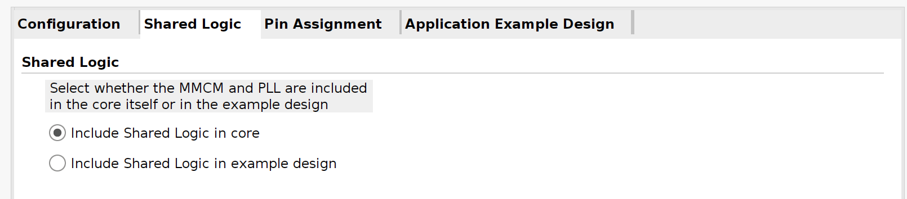

# PCAMPetaLinux

Pcam 5C 를 사용한 petalinux 예제입니다.

## 대상
### 소프트웨어

* Xilinx Vivado 2023.2
* PetaLinux 2023.2

### 하드웨어

* Genesys ZU 3EG Board : Zynq MPSoC
* Pcam 5C Camera

## Vivado 프로젝트 생성 및 빌드

`hw` 디렉토리에서 미리 생성된 프로젝트를 찾을 수 있습니다.

기본적인 생성 방법은 [BasicPetaLinux](../BasicPetaLinux/README_ko.md) 을 참고합니다.

1. 새 RTL 프로젝트 생성

2. 새 블럭 디자인 생성

3. Zynq MPSoc IP 추가

Board preset으로 자동화한 후, 블럭을 더블 클릭하여 수정합니다. 5비트 GPIO EMIO를 설정합니다. 전체 GPIO EMIO 구성은 다음과 같습니다.

* EMIO 0 (GPIO 78) : I2C mux reset
* EMIO 1 (GPIO 79) : MIPI A power
* EMIO 2 (GPIO 80) : MIPI CSI RX reset
* EMIO 3 (GPIO 81) : Video processing CSC reset
* EMIO 4 (GPIO 82) : Video frame buffer write reset


PL 클럭 출력을 다음과 같이 변경합니다. 두번째 클럭(PL1)은 DPHY 200MHz에 사용됩니다. 


3. 전체 블럭 구성

전체 블럭 구성은 [출력 파일](doc/system2.pdf)을 참고합니다.

MIPI CSI2 RX -> CSC -> Video frame buffer write
c
- Slice을 통하여 EMIO 0, 1을 외부로 내보냅니다. 이름은 추후 constraints 와 일치하여야 합니다.

- MIPI CSI2 RX를 추가합니다. EMIO를 slice를 통하여 reset에 연결하고, pl_clk1을 DPHY 200MHz에 연결합니다. Video clock은 pl_clk0 에 연결합니다. 속성을 다음과 같이 설정합니다.





- AXI4-Stream Subset Converter를 추가합니다. 속성을 다음과 같이 설정합니다.


- Video processing subsystem을 추가합니다. EMIO를 slice를 통하여 reset에 연결합니다. 속성을 다음과 같이 설정합니다.


- Video frame buffer write를 추가합니다. EMIO를 slice를 통하여 reset에 연결합니다. 속성을 다음과 같이 설정합니다.


4. 남은 항목 연결

Automation 등을 통하여 남은 항목을 연결하고 처리합니다.

5. 블럭 디자인 검증

6. HDL wrapper 생성

7. Constraints 추가

`constraints/Genesys-ZU-3EG-D-Master.xdc` 파일을 사용하여 constratins를 추가합니다. I2C mux pin, MIPI A power 외부 pin 이름과 일치하도록 주의합니다.

8. Bitstream 생성

9. 하드웨어 내보내기

## PetaLinux 프로젝트 생성 및 빌드

`os` 디렉토리에서 미리 생성된 프로젝트를 찾을 수 있습니다.

기본적인 생성 방법은 [BasicPetaLinux](../BasicPetaLinux/README_ko.md) 을 참고합니다.

1. 새 PetaLinux 프로젝트 생성

2. Export된 하드웨어로 프로젝트 설정

3. rootfs 설정

다음 명령으로 rootfs 설정에 진입합니다.

```
petalinux-config -c rootfs
```

rootfs에서 다음의 항목을 선택합니다. 추가로 필요한 항목이 있으면 선택합니다.

* Filesystem Packages/base/i2c-tools
* Filesystem Packages/misc/v4l-utils
* Filesystem Packages/misc/yavta

4. 커널 설정

다음 명령으로 커널 설정에 진입합니다.

```
petalinux-config -c kernel
```

커널 설정에서 다음 항목을 추가로 선택합니다.

* Device Drivers/Multimedia support/Media ancillary drivers/Camera sensor device/OmniVision OV5640 sensor support

커널 설정에서 다음 항목을 선택 해제합니다. 다음 항목이 선택되어있으면 해당 드라이버가 미리 가로채서 캡쳐를 구동시킬 수 없습니다.

* Device Drivers/Graphic support/Xilinx DRM CSC Driver
* Device Drivers/Graphic support/Xilinx DRM Scaler Driver

5. 사용자 device tree 파일 수정

빌드 전 `project-spec/meta-user/meta-xilinx-tools/recipes-bsp/uboot-device-tree/files/system-user.dtsi` 파일을 수정합니다. 아래 파일 내용은 위의 EMIO 및 전체 설정에 맞게 수정되었습니다.

PetaLinux 빌드 이후 자동으로 생성된 `components/plnx_workspace/device-tree/device-tree/pl.dtsi` 파일을 검토하고, 수정이 필요한 경우 다시 수정합니다.

```
/include/ "system-conf.dtsi"
#include <dt-bindings/interrupt-controller/irq.h>
#include <dt-bindings/gpio/gpio.h>
#include <dt-bindings/media/xilinx-vip.h>
#include <dt-bindings/net/ti-dp83867.h>
#include <dt-bindings/phy/phy.h>
#include <dt-bindings/mux/mux.h>

// GPIO 78 : I2C mux reset
// GPIO 79 : MIPI A power
// GPIO 80 : MIPI CSI RX
// GPIO 81 : vp csc
// GPIO 82 : vframe buffer write

/ {
	pcam_clk: pcam_clk {
		#clock-cells = <0>;
		compatible = "fixed-clock";
		clock-frequency = <12000000>;
	};

	DOVDD: fixed_regulator_DOVDD@0 {
		compatible = "regulator-fixed";
		regulator-name = "DOVDD_reg";
		regulator-min-microvolt = <1800000>;
		regulator-max-microvolt = <1800000>;
		/* MIPI A power */
		gpio = <&gpio 79 GPIO_ACTIVE_HIGH>;
		startup-delay-us = <50000>;
		enable-active-high;
	};

	AVDD: fixed_regulator_AVDD@1 {
		compatible = "regulator-fixed";
		regulator-name = "AVDD_reg";
		regulator-min-microvolt = <2800000>;
		regulator-max-microvolt = <2800000>;
	};

	DVDD: fixed_regulator_DVDD@2 {
		compatible = "regulator-fixed";
		regulator-name = "DVDD_reg";
		regulator-min-microvolt = <1500000>;
		regulator-max-microvolt = <1500000>;
	};
};

&pinctrl0 {
	status = "okay";

	pinctrl_i2c0_default: i2c0-default {
		mux {
			groups = "i2c0_5_grp"; /* MIO22, MIO23 */
			function = "i2c0";
		};

		conf {
			groups = "i2c0_5_grp";
			bias-pull-up;
			slew-rate = <0>;
			io-standard = <1>;
		};
	};

	pinctrl_i2c1_default: i2c1-default {
		mux {
			groups = "i2c1_2_grp"; /* MIO8, MIO 9 */
			function = "i2c1";
		};

		conf {
			groups = "i2c1_2_grp";
			bias-pull-up;
			slew-rate = <0>;
			io-standard = <1>;
		};
	};
};

&sdhci1 {
	disable-wp;
	xlnx,itap-delay-sd-hsd = <0x29>;
	xlnx,itap-delay-sd-ddr50 = <0x32>;
	xlnx,itap-delay-sdr25 = <0x2A>;
	xlnx,itap-delay-sdr50 = <0x1E>;
	xlnx,itap-delay-sdr104 = <0x0B>; //although auto-tuned, tuning fails on some cards if not set
};

/*
devicetree/bindings/net/macb.txt
devicetree/bindings/net/ti,dp83867.txt
devicetree/bindings/net/phy.txt
*/
&gem0 {
	phy-handle = <&phy0>;
	phy-mode = "rgmii-id";
	phy0: phy@15 {
		reg = <0x0F>;
		reset-gpios = <&gpio 44 GPIO_ACTIVE_LOW>;
		reset-assert-us = <1>;
		reset_deassert-us = <200>;
		interrupt-parent = <&gpio>;
		interrupts = <38 IRQ_TYPE_LEVEL_LOW>;
		ti,rx-internal-delay = <DP83867_RGMIIDCTL_2_00_NS>; //overwrites strap config
		ti,tx-internal-delay = <DP83867_RGMIIDCTL_1_50_NS>; //overwrites strap config
		ti,fifo-depth = <DP83867_PHYCR_FIFO_DEPTH_4_B_NIB>;
		ti,clk-output-sel = <DP83867_CLK_O_SEL_REF_CLK>;
	};
};

/*
Adding support for the mux and expose all 8 segments.
RESET# pin of TCA9548 is inverted on-board. Mapped to
EMIO[0] which is line 78.
devicetree/bindings/i2c/i2c-mux-pca954x.txt
devicetree/bindings/mux/mux-controller.txt
*/
&i2c0 {
	pinctrl-names = "default";
	pinctrl-0 = <&pinctrl_i2c0_default>;

	i2c-mux@70 {
		compatible = "nxp,pca9548";
		#address-cells = <1>;
		#size-cells = <0>;
		reg = <0x70>;
		reset-gpios = <&gpio 78 GPIO_ACTIVE_HIGH>;
		i2c-mux-idle-disconnect;
		idle-state = <MUX_IDLE_DISCONNECT>;
		i2c@0 {
			#address-cells = <1>;
			#size-cells = <0>;
			reg = <0>;

			ov5640: camera@3c {
				compatible = "ovti,ov5640";
		                reg = <0x3c>;
		                clocks = <&pcam_clk>;
		                clock-names = "xclk";
		                DOVDD-supply = <&DOVDD>; /* 1.8v */
		                AVDD-supply = <&AVDD>;  /* 2.8v */
		                DVDD-supply = <&DVDD>;  /* 1.5v */

		                port {
			        	ov5640_to_mipi_csi2: endpoint {
				                     remote-endpoint = <&mipi_csi_inmipi_csi2_rx_subsyst_0>;
				                     clock-lanes = <0>;
				                     data-lanes = <1 2>;
					};
				};
			};
		};
		i2c@1 {
			#address-cells = <1>;
			#size-cells = <0>;
			reg = <1>;
		};
		i2c@2 {
			#address-cells = <1>;
			#size-cells = <0>;
			reg = <2>;
		};
		i2c@3 {
			#address-cells = <1>;
			#size-cells = <0>;
			reg = <3>;
                        /* PMBUS */
		};
		i2c@4 {
			#address-cells = <1>;
			#size-cells = <0>;
			reg = <4>;
			eeprom@51 { /*FMC VITA 57.1 FRU*/
				compatible = "atmel,24c02";
				reg = <0x51>;
				pagesize = <1>; /* varies between models, so use a safe value */
			};
		};
		i2c@5 {
			#address-cells = <1>;
			#size-cells = <0>;
			reg = <5>;
			/* not sure if we should bind the eeprom driver to the SYZYGY DNA */
			eeprom@30 { /* SYZYGY DNA */
				compatible = "atmel,24c02";
				reg = <0x30>;
				read-only;
				address-width = <16>;
				size = <65536>; /*the whole 16-bit address range*/
			};
		};
		i2c@6 {
			#address-cells = <1>;
			#size-cells = <0>;
			reg = <6>;
		};
		i2c@7 {
			#address-cells = <1>;
			#size-cells = <0>;
			reg = <7>;
		};
	};
};

&i2c1 {
	pinctrl-names = "default";
	pinctrl-0 = <&pinctrl_i2c1_default>;
};

&spi0 {
	gpioexp: gpio@1 {
		compatible = "microchip,mcp23s08";
		gpio-controller;
		#reset-cells = <1>;
		#gpio-cells = <2>;
		interrupt-parent = <&gpio>;
		interrupts = <25 IRQ_TYPE_LEVEL_LOW>;
		microchip,spi-present-mask = <0x01>;
		interrupt-controller;
		#interrupt-cells = <0x2>;
		reg = <1>; /*SS[1]*/
		spi-max-frequency = <10000000>;
	};
};

&qspi {
	u-boot,dm-pre-reloc;
};

/* flash0 node is defined in system-conf by Petalinux */
&flash0 {
	compatible = "jedec,spi-nor";
	reg = <0>;
	spi-max-frequency = <80000000>; /* IS25LP256D max frequency for normal read 03h/13h */
	spi-tx-bus-width = <1>; /*TODO: Would quad write work?*/
	spi-rx-bus-width = <1>; /* Quad does not work in 2020.1 */
	/delete-node/ partition@0;
	/delete-node/ partition@1;
	/delete-node/ partition@2;
	partitions {
		compatible = "fixed-partitions";
		#address-cells = <1>;
		#size-cells = <1>;

		partition@0 {
        	        label = "boot";
        	        reg = <0x00000000 0x00100000>;
                };
		partition@1 {
                        label = "bootenv";
                        reg = <0x00100000 0x00040000>;
                };
		partition@2 {
                        label = "kernel";
                        reg = <0x00140000 0x01600000>;
                };
		partition@3 {
		        label = "board-id";
		        reg = <0x1FFF000 0x1000>;
			read-only;
		};
	};
};

&dwc3_0 {
	dr_mode = "host";
	snps,usb3_lpm_capable;
	snps,dis_u2_susphy_quirk ;
	snps,dis_u3_susphy_quirk ;
	maximum-speed = "super-speed";
};

&dwc3_1 {
	snps,dis_u2_susphy_quirk;
	snps,dis_u3_susphy_quirk;
	dr_mode = "host";
};

&ams_pl {
	xlnx,ext-channels {
		#address-cells = <1>;
		#size-cells = <0>;
		channel@0 {
			reg = <0>;
		};
		channel@5 {
			reg = <5>;
		};
		channel@6 {
			reg = <6>;
		};
		channel@7 {
			reg = <7>;
		};
		channel@8 {
			reg = <8>;
		};
	};
};

&gpio {
	gpio-line-names =
	"gpio0",
	"gpio1",
	"gpio2",
	"gpio3",
	"gpio4",
	"gpio5",
	"gpio6",
	"gpio7",
	"gpio8",
	"gpio9",
	"btn1",
	"btn0",
	"gpio12",
	"gpio13",
	"gpio14",
	"gpio15",
	"gpio16",
	"gpio17",
	"gpio18",
	"gpio19",
	"gpio20",
	"led0",
	"gpio22",
	"gpio23",
	"gpio24",
	"gpio25",
	"gpio26",
	"gpio27",
	"gpio28",
	"gpio29",
	"gpio30",
	"gpio31",
	"gpio32",
	"gpio33",
	"gpio34",
	"gpio35",
	"gpio36",
	"gpio37",
	"gpio38",
	"gpio39",
	"gpio40",
	"gpio41",
	"gpio42",
	"gpio43",
	"gpio44",
	"gpio45",
	"gpio46",
	"gpio47",
	"gpio48",
	"gpio49",
	"gpio50",
	"gpio51",
	"gpio52",
	"gpio53",
	"gpio54",
	"gpio55",
	"gpio56",
	"gpio57",
	"gpio58",
	"gpio59",
	"gpio60",
	"gpio61",
	"gpio62",
	"gpio63",
	"gpio64",
	"gpio65",
	"gpio66",
	"gpio67",
	"gpio68",
	"gpio69",
	"gpio70",
	"gpio71",
	"gpio72",
	"gpio73",
	"gpio74",
	"gpio75",
	"gpio76",
	"gpio77",
	"iic_mux_reset",
	"mipiA_pwup",
	"mipiB_pwup",
	"gpio81",
	"gpio82",
	"gpio83",
	"gpio84",
	"gpio85",
	"gpio86",
	"gpio87",
	"gpio88",
	"gpio89",
	"gpio90",
	"gpio91",
	"gpio92",
	"gpio93",
	"gpio94",
	"gpio95",
	"gpio96",
	"gpio97",
	"gpio98",
	"gpio99",
	"gpio100",
	"gpio101",
	"gpio102",
	"gpio103",
	"gpio104",
	"gpio105",
	"gpio106",
	"gpio107",
	"gpio108",
	"gpio109",
	"gpio110",
	"gpio111",
	"gpio112",
	"gpio113",
	"gpio114",
	"gpio115",
	"gpio116",
	"gpio117",
	"gpio118",
	"gpio119",
	"gpio120",
	"gpio121",
	"gpio122",
	"gpio123",
	"gpio124",
	"gpio125",
	"gpio126",
	"gpio127",
	"gpio128",
	"gpio129",
	"gpio130",
	"gpio131",
	"gpio132",
	"gpio133",
	"gpio134",
	"gpio135",
	"gpio136",
	"gpio137",
	"gpio138",
	"gpio139",
	"gpio140",
	"gpio141",
	"gpio142",
	"gpio143",
	"gpio144",
	"gpio145",
	"gpio146",
	"gpio147",
	"gpio148",
	"gpio149",
	"gpio150",
	"gpio151",
	"gpio152",
	"gpio153",
	"gpio154",
	"gpio155",
	"gpio156",
	"gpio157",
	"gpio158",
	"gpio159",
	"gpio160",
	"gpio161",
	"gpio162",
	"gpio163",
	"gpio164",
	"gpio165",
	"gpio166",
	"gpio167",
	"gpio168",
	"gpio169",
	"gpio170",
	"gpio171",
	"gpio172",
	"gpio173";

};

&mipi_csi2_rx_subsyst_0 {
        xlnx,csi-pxl-format = <0x1e>; // YUV4228B: 0x1e, RGB565: 0x22, RGB888: 0x24, RAW8: 0x2a
};

&mipi_csi_inmipi_csi2_rx_subsyst_0 {
        data-lanes = <1 2>;
        remote-endpoint =<&ov5640_to_mipi_csi2>;
};

&csc_port1v_proc_ss_csc {
        xlnx,video-format = <XVIP_VF_RBG>; // csc out -> vframe
};

&csc_port0v_proc_ss_csc {
        xlnx,video-format = <XVIP_VF_YUV_422>; // mipi -> csc in
};
```

6. PetaLinux 빌드

7. 부트 이미지 생성

8. 카메라 연결

9. 전원 및 부팅

## 카메라 캡쳐

정상적으로 인식된 경우 `/dev/video0` 와 `/dev/media0` 장치를 찾을 수 있습니다. 만약 인식되지 않는 경우 커널 설정과 device tree를 검토합니다.

이후 명령들은 root 권한으로 실행합니다. 다음 명령으로 전체 구성을 확인합니다.

```
media-ctl -p
```

정상적인 경우 다음과 같이 표시됩니다.

```
Media controller API version 6.1.30

Media device information
------------------------
driver          xilinx-video
model           Xilinx Video Composite Device
serial
bus info        platform:amba_pl@0:vcap_v_proc_
hw revision     0x0
driver version  6.1.30

Device topology
- entity 1: vcap_v_proc_ss_csc output 0 (1 pad, 1 link)
            type Node subtype V4L flags 0
            device node name /dev/video0
        pad0: Sink
                <- "80040000.v_proc_ss":1 [ENABLED]

- entity 5: 80000000.mipi_csi2_rx_subsystem (2 pads, 2 links)
            type V4L2 subdev subtype Unknown flags 0
            device node name /dev/v4l-subdev0
        pad0: Sink
                [fmt:UYVY8_1X16/1920x1080 field:none colorspace:srgb]
                <- "ov5640 2-003c":0 [ENABLED]
        pad1: Source
                [fmt:UYVY8_1X16/1920x1080 field:none colorspace:srgb]
                -> "80040000.v_proc_ss":0 [ENABLED]

- entity 8: 80040000.v_proc_ss (2 pads, 2 links)
            type V4L2 subdev subtype Unknown flags 0
            device node name /dev/v4l-subdev1
        pad0: Sink
                [fmt:UYVY8_1X16/1280x720 field:none colorspace:rec709]
                <- "80000000.mipi_csi2_rx_subsystem":1 [ENABLED]
        pad1: Source
                [fmt:RBG888_1X24/1280x720 field:none colorspace:rec709]
                -> "vcap_v_proc_ss_csc output 0":0 [ENABLED]

- entity 11: ov5640 2-003c (1 pad, 1 link)
             type V4L2 subdev subtype Sensor flags 0
             device node name /dev/v4l-subdev2
        pad0: Source
                [fmt:UYVY8_2X8/640x480@1/30 field:none colorspace:srgb xfer:srgb ycbcr:601 quantization:full-range
                 crop.bounds:(0,0)/2624x1964
                 crop:(16,14)/2592x1944]
                -> "80000000.mipi_csi2_rx_subsystem":0 [ENABLED]
```

다음 명령으로 각 해상도 및 color format을 지정합니다.

```
media-ctl -d /dev/media0 -v -V "\"ov5640 2-003c\":0 [fmt:UYVY8_1X16/1024x768 field:none]"
media-ctl -d /dev/media0 -v -V "\"80000000.mipi_csi2_rx_subsystem\":0 [fmt:UYVY8_1X16/1024x768 field:none]"
media-ctl -d /dev/media0 -v -V "\"80000000.mipi_csi2_rx_subsystem\":1 [fmt:UYVY8_1X16/1024x768 field:none]"
media-ctl -d /dev/media0 -v -V "\"80040000.v_proc_ss\":0 [fmt:UYVY8_1X16/1024x768 field:none]"
media-ctl -d /dev/media0 -v -V "\"80040000.v_proc_ss\":1 [fmt:RBG888_1X24/1024x768 field:none]"
```

위의 명령을 실행 후 `media-ctl -p`을 통하여 다시 한번 검토합니다. 검토 중 정상적으로 설정되지 않은 항목이 있다면, 해당 항목을 다시 설정합니다. 각 항목 중 불일치하는 항목이 있다면 캡쳐 시 `Broken pipe` 등의 오류가 발생할 수 있습니다.

다음 명령으로 `/dev/video0` 의 지원 형식을 확인합니다.

```
yavta --enum-formats /dev/video0
```

정상적인 경우 다음과 같이 표시됩니다.

```
Device /dev/video0 opened.
Device `vcap_v_proc_ss_csc output 0' on `platform:vcap_v_proc_ss_csc:0' (driver 'xilinx-vipp') supports video, capture, with mplanes.
- Available formats:
        Format 0: RGB24 (33424752)
        Type: Video capture mplanes (9)
        Name: 24-bit RGB 8-8-8

Video format: YUYV (56595559) 1920x0 field none, 0 planes:
```

다음 명령으로 캡쳐를 수행하여 파일로 저장합니다.

```
yavta -n 3 -c10 -f RGB24 -s 1024x768 --skip 7 -F /dev/video0
```

정상 동작시 다음과 같이 출력됩니다.

```
Device /dev/video0 opened.
Device `vcap_v_proc_ss_csc output 0' on `platform:vcap_v_proc_ss_csc:0' (driver 'xilinx-vipp') supports video, capture, with mplanes.
Video format set: RGB24 (33424752) 1024x768 field none, 1 planes:
 * Stride 3072, buffer size 2359296
Video format: RGB24 (33424752) 1024x768 field none, 1 planes:
 * Stride 3072, buffer size 2359296
3 buffers requested.
length: 1 offset: 4124529752 timestamp type/source: mono/EoF
Buffer 0/0 mapped at address 0xffff9a630000.
length: 1 offset: 4124529752 timestamp type/source: mono/EoF
Buffer 1/0 mapped at address 0xffff9a3f0000.
length: 1 offset: 4124529752 timestamp type/source: mono/EoF
Buffer 2/0 mapped at address 0xffff9a1b0000.
0 (0) [-] none 0 2359296 B 428.869881 428.869895 4.149 fps ts mono/EoF
1 (1) [-] none 1 2359296 B 428.903181 428.903192 30.030 fps ts mono/EoF
2 (2) [-] none 2 2359296 B 428.936478 428.936490 30.033 fps ts mono/EoF
3 (0) [-] none 3 2359296 B 428.969777 428.969789 30.031 fps ts mono/EoF
4 (1) [-] none 4 2359296 B 429.003077 429.003089 30.030 fps ts mono/EoF
5 (2) [-] none 5 2359296 B 429.036375 429.036387 30.032 fps ts mono/EoF
6 (0) [-] none 6 2359296 B 429.069674 429.069686 30.031 fps ts mono/EoF
7 (1) [-] none 7 2359296 B 429.102974 429.102986 30.030 fps ts mono/EoF
8 (2) [-] none 8 2359296 B 429.136274 429.142651 30.030 fps ts mono/EoF
9 (0) [-] none 9 2359296 B 429.169570 429.182596 30.034 fps ts mono/EoF
Captured 10 frames in 0.553732 seconds (18.059274 fps, 0.000000 B/s).
3 buffers released.
```

`sftp` 등으로 접속하여 파일을 PC로 전송 후 이미지를 확인합니다. ImageMagick으로 변환하려면 `imagemagick-6.q16` 미리 설치하고 다음의 명령으로 변환을 수행합니다.

```
convert -size 1024x768 -depth 8 RGB:frame-000008.bin cam.png
```


## 테스트 패턴

다음 명령을 통하여 user control을 확인할 수 있습니다. 카메라 장치명은 `media-ctl -p` 실행 시 확인할 수 있습니다.

```
yavta -l /dev/v4l-subdev2
```

다음 명령을 통해서 테스트 패턴을 출력하도록 지정합니다. 실제 주소는 위의 user control을 참고합니다.

```
yavta -w '0x009f0903 1' /dev/v4l-subdev2
```
테스트 패턴 확인은 위의 카메라 캡쳐와 동일하게 수행할 수 있습니다.


## 제한점

* Linux ov5640 드라이버에서 RAW10 포맷은 지원하지 않습니다.
* Linux ov5640 드라이버에서 8 bpp인 경우 최소 1280x720 부터 지원합니다.
* Linux ov5640 드라이버에서 24 bpp 인 경우 최대 1280x720 까지만 지원합니다.
* Linux ov5640 드라이버에서 미리 지정된 모드만 지원합니다. 다른 해상도를 지정할 경우 지정된 모드 중에 설정됩니다.

## 할일

### 다른 해상도 동작 확인

* 2592x1944 (RAW8, YUV422) : 테스트 패턴은 정상 캡쳐됨. 실제 화면은 RAW8, YUV422 모두 흰색 화면만 캡쳐
* 1920x1080 (RAW8, YUV422) : 테스트 패턴은 정상 캡쳐됨. 실제 화면은 RAW8은 깨진 화면, YUV422은 회색 화면으로만 캡쳐

### 캡쳐 이미지 품질 확인

* 1280x720 (RAW8, YUV422): 이미지 품질이 특히 떨어짐


